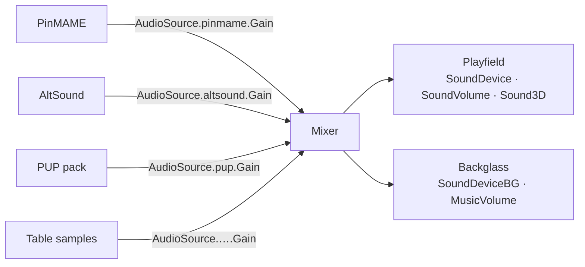

# Audio in 10.8.1

[← Index](README.md#-english) · 🇬🇧 English · [🇫🇷 Français](audio_fra.md)

Two devices, one output mode, and — since July 2026 — a gain per audio source,
which is the setting most people have been missing without knowing it existed.

## Devices and volumes

VPX splits sound in two, and the split is physical rather than musical:

| Key | Section | Range | Meaning |
|---|---|---|---|
| `SoundDevice` | `[Player]` | device name | playfield speakers — mechanical sounds |
| `SoundDeviceBG` | `[Player]` | device name | backglass speakers — music and voice |
| `SoundVolume` | `[Player]` | 0–100 | playfield volume |
| `MusicVolume` | `[Player]` | 0–100 | backglass volume |

`Sound3D` then decides how playfield sound is spread over the speakers:

| Value | Configuration |
|---|---|
| `0` | 2 front channels |
| `1` | 2 rear channels |
| `2` | up to 6 channels, rear at the lockbar |
| `3` | up to 6 channels, front at the lockbar |
| `4` | 6 ch side & rear at the lockbar, legacy mixing |
| `5` | 6 ch side & rear at the lockbar, new mixing |

Modes 4 and 5 are the surround feedback (SSF) configurations; the difference
between them is the mixing, not the wiring.

## A gain per source

This is the part worth knowing. Since
[`479fa43ab`](https://github.com/vpinball/vpinball/commit/479fa43ab), every audio
**source** gets its own persisted gain, registered at player creation in
`src/core/player.cpp`:

```cpp
const string propId = std::format("AudioSource.{}.Gain", endpointId);
Settings::GetRegistry().Register(std::make_unique<VPX::Properties::FloatPropertyDef>(
   "Player"s, propId, std::format("{} Gain", endpointName),
   std::format("Volume gain applied to audio from '{}'.", endpointName),
   true, 0.f, 2.f, 0.f, 1.f));
```

So the ini grows one key per source that has ever been seen:

```ini
[Player]
AudioSource.<endpointId>.Gain = 1.000000
```

Range `0`–`2`, neutral at `1`, shown as 0–200 % in **F12 → Audio**. The endpoint
id comes from the plugin message bus, so the sources are whatever is actually
producing sound: PinMAME, AltSound, PUP packs, the table's own samples.



**Why it matters.** Before this, a PUP pack mixed far louder than the ROM left
only one lever, the master volume, which moved everything together. Per-source
gain is what lets one source be brought down without flattening the rest — the
missing piece for balancing a cabinet, and the natural place to hang any
loudness normalisation.

The levels are persisted, so they survive a restart, and they can be overridden
per table like any other property.

## What changed around it

| Commit | Change |
|---|---|
| [`f805245e2`](https://github.com/vpinball/vpinball/commit/f805245e2) | wmp and altsound moved from a custom mixer to miniaudio's `ma_engine` |
| [`d1cf55576`](https://github.com/vpinball/vpinball/commit/d1cf55576) | the plugin controller sound API was refactored |
| [`3a2307d58`](https://github.com/vpinball/vpinball/commit/3a2307d58) | the audio enable/disable setting was removed — a source is silenced with a gain of 0 |
| [`9629bdea3`](https://github.com/vpinball/vpinball/commit/9629bdea3) | PinMAME honours `Controller.Game.Settings("sound")` |
| [`361dc0e02`](https://github.com/vpinball/vpinball/commit/361dc0e02) | PinMAME no longer broadcasts audio at a 0 sample rate |
| [`69795f154`](https://github.com/vpinball/vpinball/commit/69795f154) | sources discovered at player creation, so their gains exist before the first sound |

## Source

- `src/core/Settings_properties.inl` — devices, volumes, `Sound3D`
- `src/core/player.cpp` — audio source discovery and per-source gain registration
- `src/ui/live/ingameui/AudioSettingsPage.cpp` — the F12 page
