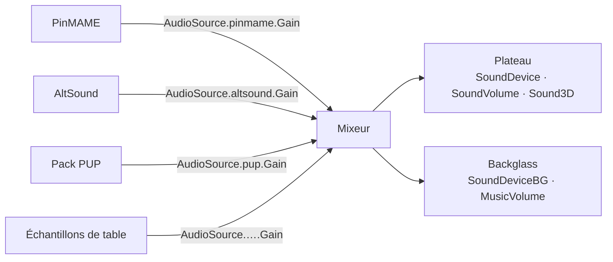

# Audio en 10.8.1

[← Index](README.md#-français) · [🇬🇧 English](audio_eng.md) · 🇫🇷 Français

Deux périphériques, un mode de sortie, et — depuis juillet 2026 — un gain par
source audio, le réglage que beaucoup cherchaient sans savoir qu'il existait.

## Périphériques et volumes

VPX sépare le son en deux, et cette séparation est physique plus que musicale :

| Clé | Section | Plage | Rôle |
|---|---|---|---|
| `SoundDevice` | `[Player]` | nom de périphérique | enceintes du plateau — sons mécaniques |
| `SoundDeviceBG` | `[Player]` | nom de périphérique | enceintes du backglass — musique et voix |
| `SoundVolume` | `[Player]` | 0–100 | volume du plateau |
| `MusicVolume` | `[Player]` | 0–100 | volume du backglass |

`Sound3D` décide ensuite comment le son du plateau se répartit sur les enceintes :

| Valeur | Configuration |
|---|---|
| `0` | 2 canaux avant |
| `1` | 2 canaux arrière |
| `2` | jusqu'à 6 canaux, arrière au lockbar |
| `3` | jusqu'à 6 canaux, avant au lockbar |
| `4` | 6 canaux côté & arrière au lockbar, mixage historique |
| `5` | 6 canaux côté & arrière au lockbar, nouveau mixage |

Les modes 4 et 5 sont les configurations de retour surround (SSF) ; ce qui les
distingue est le mixage, pas le câblage.

## Un gain par source

C'est la partie à connaître. Depuis
[`479fa43ab`](https://github.com/vpinball/vpinball/commit/479fa43ab), chaque
**source** audio reçoit son propre gain persistant, enregistré à la création du
joueur dans `src/core/player.cpp` :

```cpp
const string propId = std::format("AudioSource.{}.Gain", endpointId);
Settings::GetRegistry().Register(std::make_unique<VPX::Properties::FloatPropertyDef>(
   "Player"s, propId, std::format("{} Gain", endpointName),
   std::format("Volume gain applied to audio from '{}'.", endpointName),
   true, 0.f, 2.f, 0.f, 1.f));
```

L'ini se garnit donc d'une clé par source déjà rencontrée :

```ini
[Player]
AudioSource.<endpointId>.Gain = 1.000000
```

Plage `0`–`2`, neutre à `1`, affichée de 0 à 200 % dans **F12 → Audio**.
L'identifiant de source vient du bus de messages des plugins : les sources sont
donc ce qui produit réellement du son — PinMAME, AltSound, les packs PUP, les
échantillons propres à la table.



**Pourquoi c'est important.** Auparavant, un pack PUP mixé bien plus fort que la
ROM ne laissait qu'un seul levier, le volume général, qui déplaçait tout
ensemble. Le gain par source est ce qui permet de baisser une source sans
écraser les autres — la pièce manquante pour équilibrer un cabinet, et l'endroit
naturel où accrocher une normalisation de niveau sonore.

Les niveaux sont persistés, donc ils survivent à un redémarrage, et ils peuvent
être surchargés par table comme n'importe quelle autre propriété.

## Ce qui a changé autour

| Commit | Changement |
|---|---|
| [`f805245e2`](https://github.com/vpinball/vpinball/commit/f805245e2) | wmp et altsound passent d'un mixeur maison au `ma_engine` de miniaudio |
| [`d1cf55576`](https://github.com/vpinball/vpinball/commit/d1cf55576) | l'API son du contrôleur de plugin a été refondue |
| [`3a2307d58`](https://github.com/vpinball/vpinball/commit/3a2307d58) | le réglage d'activation/désactivation de l'audio a disparu — une source se coupe avec un gain à 0 |
| [`9629bdea3`](https://github.com/vpinball/vpinball/commit/9629bdea3) | PinMAME respecte `Controller.Game.Settings("sound")` |
| [`361dc0e02`](https://github.com/vpinball/vpinball/commit/361dc0e02) | PinMAME ne diffuse plus d'audio à une fréquence d'échantillonnage nulle |
| [`69795f154`](https://github.com/vpinball/vpinball/commit/69795f154) | les sources sont découvertes dès la création du joueur, leurs gains existent donc avant le premier son |

## Sources

- `src/core/Settings_properties.inl` — périphériques, volumes, `Sound3D`
- `src/core/player.cpp` — découverte des sources et enregistrement du gain par source
- `src/ui/live/ingameui/AudioSettingsPage.cpp` — la page F12
