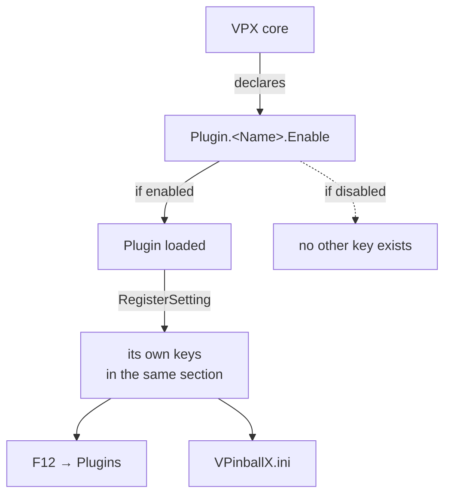

# Plugins in 10.8.1

[← Index](README.md#-english) · 🇬🇧 English · [🇫🇷 Français](plugins_fra.md)

PinMAME, B2S, PUP, DOF, FlexDMD, AltSound, Serum and the score view are no
longer parts of VPX. They are plugins, each owning its settings — which is why
old keys like `PUPCapture` or `B2SWindows` vanished from `[Player]`, see
[Removed](removed_eng.md#external-windows).

## One section per plugin

Every plugin gets its own ini section, `[Plugin.<Name>]`, and always has at least
an `Enable` key:

```ini
[Plugin.PinMAME]
; Enable: Enable PinMAME plugin [Default: 1]
Enable =
Sound =
Cheat =
PinMAMEPath =
```

The ten `Enable` keys are declared in `src/core/Settings_properties.inl`:

| Section | Plugin | Enabled by default |
|---|---|---|
| `[Plugin.PinMAME]` | ROM emulation | standalone builds only |
| `[Plugin.B2SLegacy]` | legacy backglass | standalone builds only |
| `[Plugin.ScoreView]` | score view / DMD rendering | standalone builds only |
| `[Plugin.PUP]` | PinUP Player | standalone builds only |
| `[Plugin.FlexDMD]` | FlexDMD | standalone builds only |
| `[Plugin.Serum]` | Serum colourisation | standalone builds only |
| `[Plugin.WMP]` | media playback | standalone builds only |
| `[Plugin.AltSound]` | alternative sound packs | off |
| `[Plugin.VNI]` | VNI colourisation | off |
| `[Plugin.DMDUtil]` | external DMD devices | off |

`g_isStandalone` is what decides the default: the standalone builds — the ones
cabinets run — turn most of them on, a plain desktop build does not.

## Where the other keys come from

Only `Enable` is declared by VPX. Everything else in a plugin's section is
declared **by the plugin itself**, at load time, through the message API:

```cpp
MSGPI_BOOL_VAL_SETTING(enableSoundProp, "Sound", "Enable Sound", "Enable sound emulation", true, true);
MSGPI_STRING_VAL_SETTING(pinMAMEPathProp, "PinMAMEPath", "PinMAME Path",
                         "Folder that contains PinMAME subfolders (roms, nvram, ...)", true, "", 1024);
MSGPI_BOOL_VAL_SETTING(cheatProp, "Cheat", "Cheat Mode", "", true, false);

msgApi->RegisterSetting(endpointId, &enableSoundProp);
msgApi->RegisterSetting(endpointId, &pinMAMEPathProp);
msgApi->RegisterSetting(endpointId, &cheatProp);
```

Two consequences follow, and they explain most of the confusion around plugin
configuration.

**A disabled plugin declares nothing.** Its keys do not appear in the ini and do
not show up in the F12 UI, because the code that registers them never runs. An
empty-looking section is not a broken install; it is a plugin that has not been
loaded yet.

**The authoritative list is the plugin's source**, not `Settings_properties.inl`.
Looking for `Sound` or `Cheat` in VPX's property file finds nothing — they live
in `plugins/pinmame/PinMAMEPlugin.cpp`.



## PinMAME

`[Plugin.PinMAME]`, from `plugins/pinmame/PinMAMEPlugin.cpp`:

| Key | Type | Default | Meaning |
|---|---|---|---|
| `Enable` | bool | on (standalone) | load the plugin |
| `Sound` | bool | on | sound emulation |
| `Cheat` | bool | off | cheat mode |
| `PinMAMEPath` | string | empty | folder holding the `roms`, `nvram`… subfolders |

It also publishes an audio source named `PinMAME`, targeted at the backglass,
which is what gives it an entry in the per-source gains — see
[Audio](audio_eng.md#a-gain-per-source).

## Source

- `src/core/Settings_properties.inl` — the ten `Enable` keys and their defaults
- `plugins/<name>/` — each plugin's own settings, registered via `RegisterSetting`
- `plugins/README.md` — the plugin API itself
