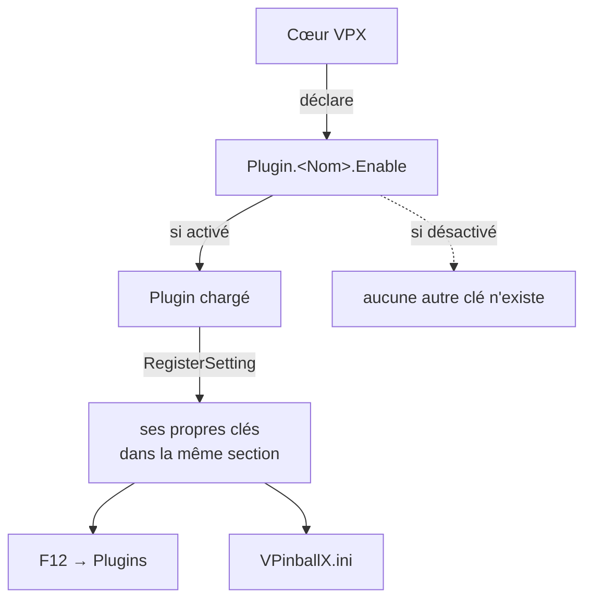

# Plugins en 10.8.1

[← Index](README.md#-français) · [🇬🇧 English](plugins_eng.md) · 🇫🇷 Français

PinMAME, B2S, PUP, DOF, FlexDMD, AltSound, Serum et le score view ne font plus
partie de VPX. Ce sont des plugins, chacun propriétaire de ses réglages — d'où
la disparition d'anciennes clés comme `PUPCapture` ou `B2SWindows` de la section
`[Player]`, voir [Supprimés](removed_fra.md#fenêtres-externes).

## Une section par plugin

Chaque plugin dispose de sa propre section d'ini, `[Plugin.<Nom>]`, et possède
toujours au moins une clé `Enable` :

```ini
[Plugin.PinMAME]
; Enable: Enable PinMAME plugin [Default: 1]
Enable =
Sound =
Cheat =
PinMAMEPath =
```

Les dix clés `Enable` sont déclarées dans `src/core/Settings_properties.inl` :

| Section | Plugin | Actif par défaut |
|---|---|---|
| `[Plugin.PinMAME]` | émulation des ROM | builds standalone seulement |
| `[Plugin.B2SLegacy]` | backglass historique | builds standalone seulement |
| `[Plugin.ScoreView]` | rendu du score view / DMD | builds standalone seulement |
| `[Plugin.PUP]` | PinUP Player | builds standalone seulement |
| `[Plugin.FlexDMD]` | FlexDMD | builds standalone seulement |
| `[Plugin.Serum]` | colorisation Serum | builds standalone seulement |
| `[Plugin.WMP]` | lecture de médias | builds standalone seulement |
| `[Plugin.AltSound]` | packs sonores alternatifs | non |
| `[Plugin.VNI]` | colorisation VNI | non |
| `[Plugin.DMDUtil]` | afficheurs DMD externes | non |

C'est `g_isStandalone` qui décide du défaut : les builds standalone — celles que
font tourner les cabinets — en activent la plupart, une build desktop ordinaire
non.

## D'où viennent les autres clés

VPX ne déclare que `Enable`. Tout le reste d'une section de plugin est déclaré
**par le plugin lui-même**, à son chargement, via l'API de messages :

```cpp
MSGPI_BOOL_VAL_SETTING(enableSoundProp, "Sound", "Enable Sound", "Enable sound emulation", true, true);
MSGPI_STRING_VAL_SETTING(pinMAMEPathProp, "PinMAMEPath", "PinMAME Path",
                         "Folder that contains PinMAME subfolders (roms, nvram, ...)", true, "", 1024);
MSGPI_BOOL_VAL_SETTING(cheatProp, "Cheat", "Cheat Mode", "", true, false);

msgApi->RegisterSetting(endpointId, &enableSoundProp);
msgApi->RegisterSetting(endpointId, &pinMAMEPathProp);
msgApi->RegisterSetting(endpointId, &cheatProp);
```

Deux conséquences en découlent, et elles expliquent l'essentiel de la confusion
autour de la configuration des plugins.

**Un plugin désactivé ne déclare rien.** Ses clés n'apparaissent ni dans l'ini ni
dans l'interface F12, puisque le code qui les enregistre ne s'exécute jamais. Une
section qui paraît vide n'est pas une installation cassée : c'est un plugin qui
n'a pas encore été chargé.

**La liste qui fait foi est le code du plugin**, pas `Settings_properties.inl`.
Chercher `Sound` ou `Cheat` dans le fichier de propriétés de VPX ne donne rien :
ils vivent dans `plugins/pinmame/PinMAMEPlugin.cpp`.



## PinMAME

`[Plugin.PinMAME]`, d'après `plugins/pinmame/PinMAMEPlugin.cpp` :

| Clé | Type | Défaut | Rôle |
|---|---|---|---|
| `Enable` | booléen | actif (standalone) | charger le plugin |
| `Sound` | booléen | actif | émulation du son |
| `Cheat` | booléen | inactif | mode triche |
| `PinMAMEPath` | chaîne | vide | dossier contenant les sous-dossiers `roms`, `nvram`… |

Il publie également une source audio nommée `PinMAME`, dirigée vers le
backglass, ce qui lui donne une entrée dans les gains par source — voir
[Audio](audio_fra.md#un-gain-par-source).

## Sources

- `src/core/Settings_properties.inl` — les dix clés `Enable` et leurs défauts
- `plugins/<nom>/` — les réglages propres à chaque plugin, enregistrés via `RegisterSetting`
- `plugins/README.md` — l'API de plugin elle-même
