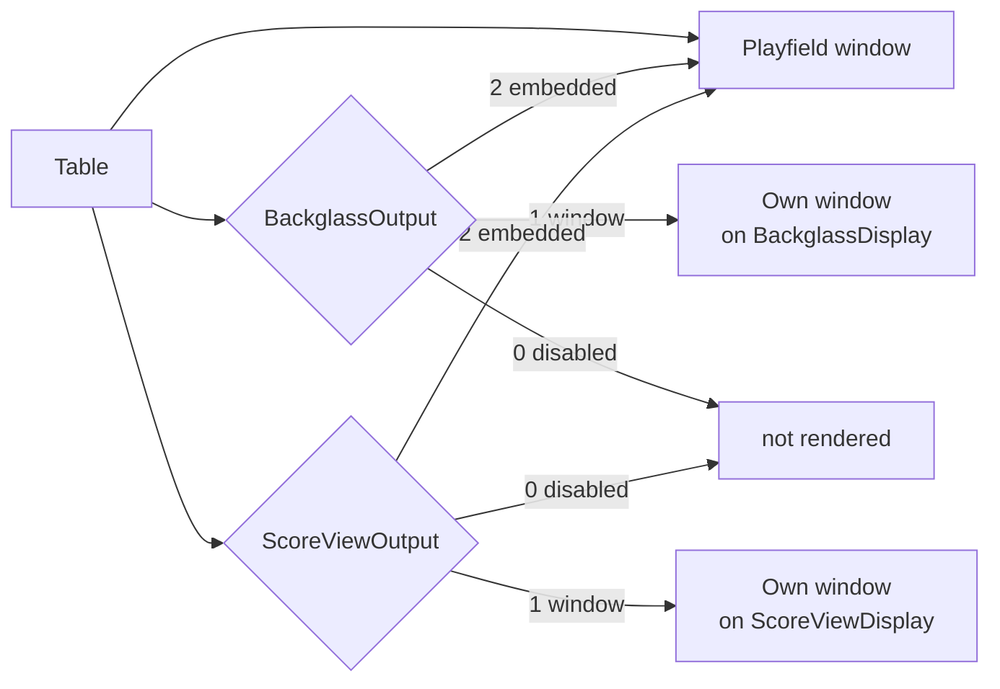

# Windows and displays in 10.8.1

[← Index](README.md#-english) · 🇬🇧 English · [🇫🇷 Français](window_fra.md)

The window setup was rewritten in November 2025
([`ab19a7e4f`](https://github.com/vpinball/vpinball/commit/ab19a7e4f)) and moved
to the property registry
([`bd8c77206`](https://github.com/vpinball/vpinball/commit/bd8c77206)). Four
outputs now share one identical set of settings, where the standalone build used
to carry its own per-window keys — see [Removed](removed_eng.md#external-windows)
for the ones that went.

## Four outputs, one schema

| Output | Section | Prefix |
|---|---|---|
| Playfield | `[Player]` | `Playfield` |
| Backglass | `[Backglass]` | `Backglass` |
| Score view (DMD) | `[ScoreView]` | `ScoreView` |
| Topper | `[Topper]` | `Topper` |

Every output takes the same eleven keys, prefixed by its own name:

```ini
[Backglass]
BackglassOutput      = 1     ; 0 disabled, 1 window, 2 embedded in the playfield
BackglassDisplay     =       ; display name, as VPX enumerates it
BackglassFullScreen  = 0     ; 0 windowed, 1 borderless fullscreen
BackglassWndX        = 0     ; windowed position on that display
BackglassWndY        = 0
BackglassWidth       = 1920  ; windowed size
BackglassHeight      = 1080
BackglassFSWidth     = 1920  ; fullscreen size — a separate pair
BackglassFSHeight    = 1080
BackglassRefreshRate = 0     ; fullscreen only, 0 = let the driver choose
BackglassColorDepth  = 32    ; fullscreen only
```

Three points are easy to get wrong.

**Windowed and fullscreen sizes are separate keys.** `Width`/`Height` apply in
windowed mode, `FSWidth`/`FSHeight` in fullscreen. Setting the first pair and
switching to fullscreen changes nothing visible, which reads as the setting being
ignored.

**`RefreshRate` and `ColorDepth` only apply in fullscreen.** They describe a
display mode, not a window.

**Under BGFX there is no exclusive fullscreen.** `FullScreen` offers two values,
windowed and borderless fullscreen; the third value, real fullscreen, only exists
in non-BGFX builds. On a cabinet, borderless fullscreen is the one that behaves.

## Output modes

`<Prefix>Output` selects what the output is, from `Window::OutputMode` in
`src/renderer/Window.h`:

| Value | Name | Meaning |
|---|---|---|
| `0` | `OM_DISABLED` | the output does not exist |
| `1` | `OM_WINDOW` | a native window of its own — the cabinet case |
| `2` | `OM_EMBEDDED` | drawn inside the playfield window |

Mode `2` is what lets a single-screen setup show a backglass or a score view
without a second display: the surface is composited into the playfield window
rather than given a window of its own.



## Naming the display

`<Prefix>Display` holds a display **name**, not an index. VPX enumerates
displays through SDL, and the name it reports depends on the video driver in
use: the same panel can appear as `Iiyama North America 42"` under Wayland,
`DP-1 42"` under XWayland and `PL4380UH 42"` under a real Xorg session.

A name written under one driver therefore does not resolve under another, and the
window falls back to the primary display. This is not a bug in the ini; it is
what happens when the identity of a screen comes from the driver.

## Physical dimensions

Two settings in `[Player]` describe the playfield screen in the real world,
in centimetres, and have nothing to do with pixels:

| Key | Range | Default | Meaning |
|---|---|---|---|
| `ScreenWidth` | 5–200 cm | 95.89 | width of the **visible** playfield area |
| `ScreenHeight` | 5–200 cm | 53.94 | height of that area |
| `ScreenInclination` | −30…30 ° | 0 | the screen's angle, 0 being horizontal |

The property's own description says **width > height**: these are given in
landscape orientation, even when the screen is mounted portrait in the cabinet —
which is how it is mounted on every cabinet. Swapping them because the panel
stands upright is the single easiest way to misframe every table at once. They
are the visible area, not the panel diagonal.

They were introduced with the window/POV work
([`cfdb53635`](https://github.com/vpinball/vpinball/commit/cfdb53635)) and are
required by cabinet autofit, which refuses to run without them — see
[View](view_eng.md#what-autofit-needs-from-the-table).

## Source

- `src/core/Settings_properties.inl` — the eleven keys, per output, with ranges and defaults
- `src/renderer/Window.h` — `OutputMode`, and what a window actually is
- `src/renderer/Window.cpp` — display enumeration and mode selection
