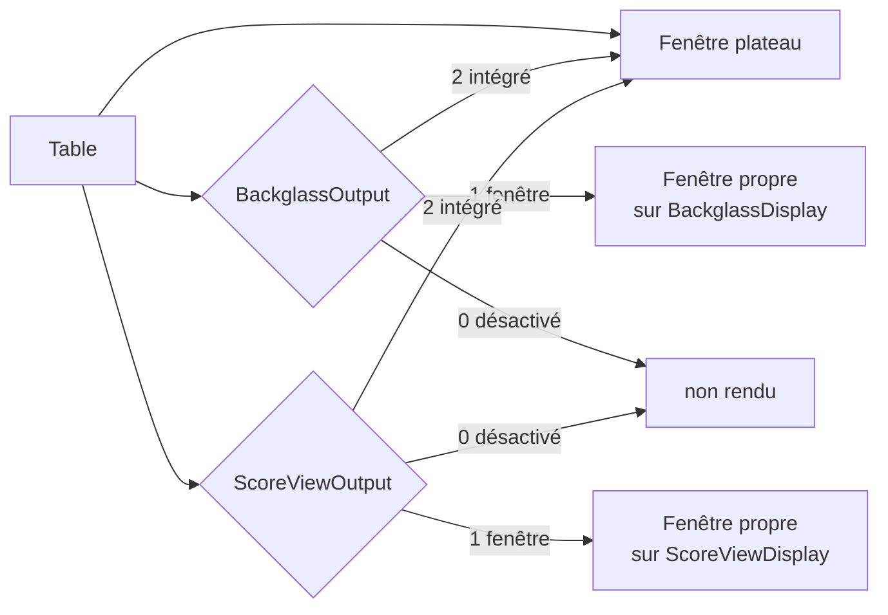

# Fenêtres et écrans en 10.8.1

[← Index](README.md#-français) · [🇬🇧 English](window_eng.md) · 🇫🇷 Français

La configuration des fenêtres a été réécrite en novembre 2025
([`ab19a7e4f`](https://github.com/vpinball/vpinball/commit/ab19a7e4f)) puis
migrée vers le registre de propriétés
([`bd8c77206`](https://github.com/vpinball/vpinball/commit/bd8c77206)). Quatre
sorties partagent désormais un jeu de réglages identique, là où la build
standalone portait ses propres clés par fenêtre — voir
[Supprimés](removed_fra.md#fenêtres-externes) pour celles qui ont disparu.

## Quatre sorties, un seul schéma

| Sortie | Section | Préfixe |
|---|---|---|
| Plateau | `[Player]` | `Playfield` |
| Backglass | `[Backglass]` | `Backglass` |
| Score view (DMD) | `[ScoreView]` | `ScoreView` |
| Topper | `[Topper]` | `Topper` |

Chaque sortie prend les mêmes onze clés, préfixées par son nom :

```ini
[Backglass]
BackglassOutput      = 1     ; 0 désactivé, 1 fenêtre, 2 intégré au plateau
BackglassDisplay     =       ; nom de l'écran, tel que VPX l'énumère
BackglassFullScreen  = 0     ; 0 fenêtré, 1 plein écran sans bordure
BackglassWndX        = 0     ; position en mode fenêtré, sur cet écran
BackglassWndY        = 0
BackglassWidth       = 1920  ; taille en mode fenêtré
BackglassHeight      = 1080
BackglassFSWidth     = 1920  ; taille en plein écran — un couple distinct
BackglassFSHeight    = 1080
BackglassRefreshRate = 0     ; plein écran seulement, 0 = laisser le pilote choisir
BackglassColorDepth  = 32    ; plein écran seulement
```

Trois points se trompent facilement.

**Les tailles fenêtrée et plein écran sont des clés distinctes.**
`Width`/`Height` s'appliquent en mode fenêtré, `FSWidth`/`FSHeight` en plein
écran. Régler le premier couple puis passer en plein écran ne change rien de
visible, ce qui se lit comme un réglage ignoré.

**`RefreshRate` et `ColorDepth` ne valent qu'en plein écran.** Ils décrivent un
mode d'affichage, pas une fenêtre.

**Sous BGFX, il n'y a pas de plein écran exclusif.** `FullScreen` ne propose que
deux valeurs, fenêtré et plein écran sans bordure ; la troisième, le vrai plein
écran, n'existe que dans les builds non-BGFX. Sur un cabinet, c'est le plein
écran sans bordure qui se comporte correctement.

## Modes de sortie

`<Préfixe>Output` choisit ce qu'est la sortie, d'après `Window::OutputMode` dans
`src/renderer/Window.h` :

| Valeur | Nom | Sens |
|---|---|---|
| `0` | `OM_DISABLED` | la sortie n'existe pas |
| `1` | `OM_WINDOW` | une fenêtre native à elle — le cas du cabinet |
| `2` | `OM_EMBEDDED` | dessinée à l'intérieur de la fenêtre du plateau |

Le mode `2` est ce qui permet à une installation mono-écran d'afficher un
backglass ou un score view sans second écran : la surface est composée dans la
fenêtre du plateau au lieu de recevoir une fenêtre propre.



## Nommer l'écran

`<Préfixe>Display` contient un **nom** d'écran, pas un indice. VPX énumère les
écrans via SDL, et le nom rapporté dépend du pilote vidéo utilisé : la même dalle
peut apparaître comme `Iiyama North America 42"` sous Wayland, `DP-1 42"` sous
XWayland et `PL4380UH 42"` sous une vraie session Xorg.

Un nom écrit sous un pilote ne se résout donc pas sous un autre, et la fenêtre
retombe sur l'écran principal. Ce n'est pas un défaut de l'ini : c'est ce qui
arrive quand l'identité d'un écran vient du pilote.

## Dimensions physiques

Trois réglages de `[Player]` décrivent l'écran du plateau dans le monde réel, en
centimètres, et n'ont rien à voir avec les pixels :

| Clé | Plage | Défaut | Sens |
|---|---|---|---|
| `ScreenWidth` | 5–200 cm | 95,89 | largeur de la zone **visible** du plateau |
| `ScreenHeight` | 5–200 cm | 53,94 | hauteur de cette zone |
| `ScreenInclination` | −30…30 ° | 0 | inclinaison de l'écran, 0 étant l'horizontale |

La description de la propriété précise **width > height** : ces valeurs se
donnent en orientation paysage, même quand l'écran est monté en portrait dans le
cabinet — c'est-à-dire dans tous les cabinets. Les intervertir sous prétexte que
la dalle est debout est le moyen le plus simple de décadrer toutes les tables
d'un coup. Il s'agit de la zone visible, pas de la diagonale de la dalle.

Elles ont été introduites avec le travail sur les fenêtres et le point de vue
([`cfdb53635`](https://github.com/vpinball/vpinball/commit/cfdb53635)) et sont
exigées par l'ajustement automatique, qui refuse de s'exécuter sans elles — voir
[Vue](view_fra.md#ce-que-lajustement-attend-de-la-table).

## Sources

- `src/core/Settings_properties.inl` — les onze clés par sortie, plages et défauts
- `src/renderer/Window.h` — `OutputMode`, et ce qu'est réellement une fenêtre
- `src/renderer/Window.cpp` — énumération des écrans et choix du mode
