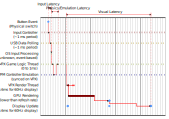

# Latency

One very impacting thing when emulating/simulating pinball machines is latency. Therefore, VPX has been optimized for very low latency, but each setup is different and the following informations are here to help to understand, measure and adjust settings accordingly.

Latency is the delay between a stimulus and its consequence. For VPX, there are 3 types of latency to consider:
- **Input latency**: the delay between when an input event happens and when it is taken into account by VPX.
- **Physics/Emulation latency**: the delay between the moment when something happens (balls roll over a switch for example) and the emulation is actually aware of it.
- **Visual latency**: the delay between when the game emulation/simulation is in a certain state and when this state is displayed on the screen.

To make things worse, the overall latency will feature some 'random' variance, due to most of the factors mentioned above taking slightly less or more time on each turnaround.
This makes it even harder for the human brain to adapt to this kind of delay, as it can vary so much. Thus, minimizing the average turnaround latency is key to also bringing down
this unpredictable variance.

Each of the mentioned latencies present different challenges which are described below. The informations given here are mostly relevant to the BGFX variant as it leverages the BGFX multithreading capabilities for better latency results, whereas the OpenGL and DX9 variants have higher latencies due to their single threaded nature.

## Input latency

Input is polled continuously, targeting a resolution below 1ms, and directly fed to the VPX engine which is ran at a 1ms step precision. The average and maximum input latency is displayed when pressing F11 (delay between last poll and when it is taken into account by the engine, excluding the OS/USB/hardware latencies).

## Physics/Emulation latency

When a physic state change causes a switch to change its position, its state must be adjusted, the emulated controller must detect it and react accordingly, and then the corresponding reaction must be applied back to the physics engine.

For example in Williams' WPC Fliptronic, when the user presses a flipper button, it is detected by the WPC CPU which in turn activates the flipper solenoid, the overall process taking about 0.5 to 1ms.

To be as close as possible to this behavior, the PinMAME controller emulation and the physics simulation are run continuously, targeting a maximum of 0.5ms of sync difference between them.

An optimized emulation of the flipper solenoids nicknamed 'FastFlips' is also implemented in most modern table recreations. It lowers the latency even below this value by immediatly performing what the emulated CPU controller will trigger later-on. It is really needed when running DX9/OpenGL variants where input is (mostly) sampled at the framerate (usually every 16.6ms when running on a 60Hz display).

## Visual latency

Visual latency impacts the player reaction, as reacting to things that haven't been displayed yet is difficult. Therefore, it directly matters to keep it as low as possible. This latency is somewhat complex as it implies the following steps:
- First, VPX creates a list of commands to render the scene, capturing the state of the game at this point in time,
- Then, VPX submits it to the GPU, needing to wait for the GPU to be in a state where it can accept these commands (GPUs have a limited number of 'frames in flight', that is to say frames still pending to be rendered),
- The GPU performs the rendering, maybe waiting for a backbuffer to be available to render on it (one of the buffers used for rendering, also depending on the 'VSync' setting),
- This rendered backbuffer must be composed with other parts of the desktop (or just pushed forward when the window covers the full screen),
- The resulting image (VPX + desktop) must be sent to the display, eventually syncing on the displays 'VSync' to avoid tearing,
- The display must display it, featuring its own additional latency that may be lengthened by (optional) processing steps

All these steps take time and, in the end, the displayed image corresponds to a game state that happened quite some time ago.

There is no way to display the visual latency directly inside VPX. To measure the visual latency, one may install the opensource application [PresentMon](https://github.com/GameTechDev/PresentMon/releases). Then run it in a command prompt to display the overall framerate and latency.

To optimize this value, one will likely want to run the BGFX variant, using a window that covers the entire screen (or fullscreen mode, which does the same). In this situation, PresentMon should mention that 'PresentMode' is 'Hardware: Independent Flip' and the latency should be a bit larger than the display rate (for example, on a 144Hz display, that is to say 1/144 = 7ms per frame, latency should be around 8ms). Note that not all hardwares do support these optimized latency modes.
In addition, one should research which configuration and resolution of the used TV/monitor setup will result in its lowest latency.
E.g. some TVs feature a specialized 'Game Mode', some monitors need to run at a certain Hz/resolution config, or certain postprocessing has to be disabled, in order to minimize its latency.

VPX offers to compensate the visual latency of balls by rendering them at their predicted position (where they will be when the image will be displayed instead of where they are when the frame is prepared).
To enable this feature, set the latency correction in the rendering options to either -1 (apply an default correction based on your display refresh rate) or your personal setup latency, measured in milliseconds.

## Overall scheme

The scheme below illustrates these elements with a flipper state change:
1. move fingers, press button, mechanical contact, electric signal available to pinball input device (mostly instantaneous)
2. pinball input device processes, then communicates with computer through USB
3. computer input API processes and makes this data available to VPX
4. VPX processes the input and reports it to the table script, which updates a switch state table for PinMAME
5. PinMAME reads the switch state table and emulates the controller CPU, in turn toggling a virtual solenoid output
6. VPX synchronizes with PinMAME and reports the solenoid state change to the script which notifies the physics engine to move the flipper
7. VPX's physics engine actually moves the flipper

Note that with 'FastFlips' steps 5 and 6 are skipped, but all the others remain.

[Information applicable to version 10.8.1 Beta]
