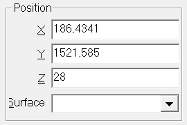

# Lights

## Table of Contents
1. [Lightmaps](#Lightmaps)
2. [Fading](#Fading)
3. [Shadows](#Shadows)
4. [Reflections](#Reflections)

## Lightmaps
VPX renders lights using 'lightmaps', which basically renders a flat surface for the range that the light illuminates.
This surface may be either an opaque surface for 'Classic' lights, or a transparent additive surface for 'Halo' lights.

You may also choose to use custom lightmaps which are made of Flasher or Primitive objects, with their 'lightmap' property pointing to a light object.
Their opacity will then be modulated by the light intensity ratio.

## Fading
When a light is switched on or off, it fades up and down. VPX is able to simulate 3 behaviors:
- Incandescent bulb, for which a complete physical model is used, simulating the bulb's filament temperature (which can also be accessed from script) and tinting the light's color accordingly (no tint at full power, turning slightly red when cooling down),
- LED bulb, which switches instantaneously to the requested state (no fading),
- Linear, which performs a simple linear interpolation using the selected speed.

## Shadows
VPX only supports dynamic shadows between balls and lightmaps (from light objects or flasher/primitives used as the lightmap).
These shadows are computed using raytracing between the ball and the light source, as defined in the editor (using the defined surface offsetted by the given z property).

The softness of the shadow depends on the distance between ball and bulb, the radius of the ball, and the radius of the bulb (which is fixed to a value of 0.1 inches).

## Reflections
Light reflections on balls are directly rendered, if the corresponding checkbox is enabled in the editor.
Note that even a light set to 'None' mode for rendering (no lightmap) can have this checkbox enabled and therefore have its reflection visible on balls.

[Information applicable to version 10.8.1 Beta]