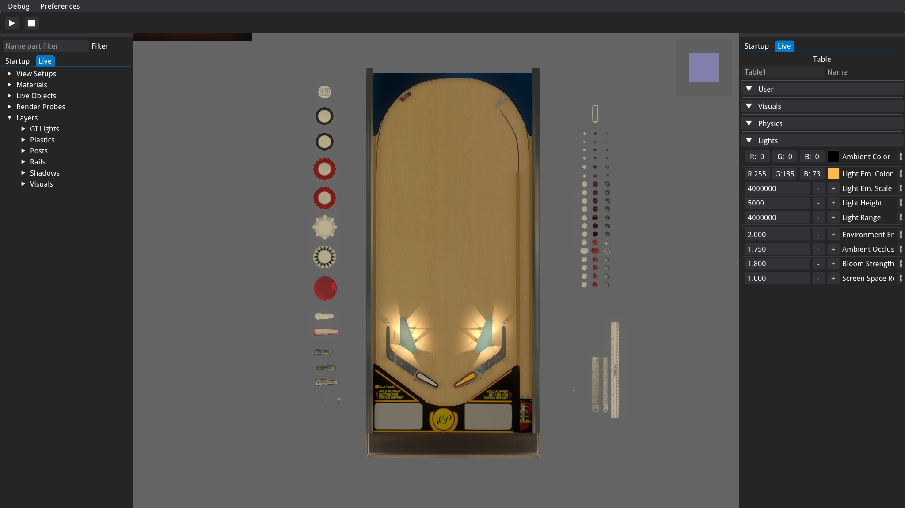

# Live User Interface

Disclaimer: The Live UI is a very new and very incomplete feature. For the time being it only allows limited edits and inspection.

## Table of Contents
1. [Key concepts](#Key-concepts)
2. [The viewport](#The-viewport)
3. [Outliner](#Outliner)
4. [Properties](#Properties)
5. [Keyboard shortcuts](#Keyboard-shortcuts)

## Key concepts
The live editor allows to modify a table while you play it.
When a table is played, its properties are dynamically changing according to user input (light states, moving the flipper bats,...). Therefore, the UI displays 2 states:
- Startup state: the table as it is in the editor, changes on this state do persist (saved),
- Live state: the table as it is shown in the viewport, with its properties animated.

You can select any part using the 'Outliner' (on the left), the upper tab allows to switch between startup/live states. The same applies to the 'Property' (on the right) view.

When you change a property in one of these states, the little floppy disk located alongside the property will be available to copy the new value to the other state. For example, you can tweak the position of a primitive of the live state (with visual feedback) then press the floppy disk to save it to the startup state: the next time you will start the table, the primitive will use this new position.

## The viewport
The viewport shows the **live** state of the table.

You can:
- **Orbit** around the selected part (shown by a white dot if any) using the upper left cube,
- **Pan** the view by pressing the third mouse button (mousewheel) while having the [Shift] key pressed,
- **Zoom** using the mousewheel.

Lots of [keyboard shortcuts](#Keyboard-shortcuts) are also availables to navigate around.

## Outliner
The outliner tab, located on the left, allows to select the datablocks that define the table, in order to locate and edit them, with visual feedback.

Beside the table parts located in the layers like in the main UI, you will also find other blocks like materials or renderprobe. The outliner offers a special group named 'Live Objects' which contains objects dynamically created by the player like the playfield or balls.

To help finding a part, a filter edit field is located at the top. Entering a text in it will filter out all parts that do not contain this text in their name.

## Properties

The property tab, located on the right, allows to edit the selected part, or the table if none is selected.

## Keyboard shortcuts
| Key      | Description                                                                         |
| -------- | ----------------------------------------------------------------------------------- |
| P        | Toggle Play/Pause                                                                   |
| F        | Toggle UI display (fly camera mode)                                                 |
| Esc      | Cancel current operation or open dialog to get back to the editor/table             |
| G        | Grab (move) the selected part (multiple presses toggle world/object origin)         |
| R        | Rotate the selected part (multiple presses toggle world/object origin)              |
| S        | Scale the selected part (multiple presses toggle world/object origin)               |
| Keypad 5 | Toggle perspective/orthographic view                                                |
| Keypad . | Center view on selected part                                                        |
| 1        | Look from front                                                                     |
| Ctrl + 1 | Look from back                                                                      |
| 3        | Look from left                                                                      |
| Ctrl + 3 | Look from right                                                                     |
| 7        | Look from top                                                                       |
| Ctrl + 7 | Look from bottom                                                                    |

[Information applicable to version 10.8 Beta]
