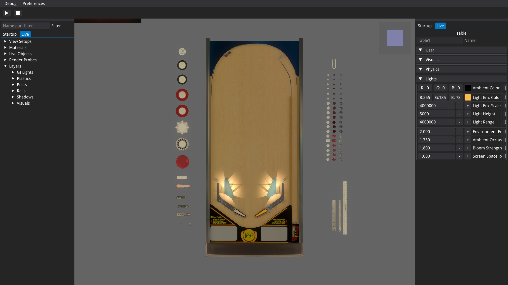

# Live User Interface

Disclaimer: The Live UI is a very new and very incomplete feature. For the time being it only allows limited edits and inspection.

## Table of Contents
1. [Key concepts](#Key-concepts)
2. [The viewport](#The-viewport)
3. [Outliner](#Outliner)
4. [Properties](#Properties)
5. [Keyboard shortcuts](#Keyboard-shortcuts)

## Key concepts
The live editor may be used in 2 different modes:
- **Tweak mode**: while playing a table, to inspect and tweak its properties. It is opened either from the main editor ('Table' > 'Live Table Editor' or [F7]), or during play from the in-game UI ('Live Editor' entry, only available for tables launched from the main editor, with a keyboard, and not in VR).
- **Edit mode**: as a standalone table editor, started with the `-LiveEdit` [command line option](<Command Line.md>) (optionally followed by a table filename). It offers more advanced edition capabilities (saving, undo, part visibility, drag point edition,...) but is in a preview state: it is still unstable and should only be used on test tables.

In tweak mode, the edited table is a played copy which keeps running (and may be paused), its properties dynamically changing according to user input (light states, moving the flipper bats,...). Therefore, the UI displays 2 states:
- Startup state: the table as it is in the editor, changes on this state do persist (saved),
- Live state: the table as it is shown in the viewport, with its properties animated.

You can select any part using the 'Outliner' (on the left), the upper tab allows to switch between startup/live states. The same applies to the 'Property' (on the right) view.

When you change a property in one of these states, the little floppy disk located alongside the property will be available to copy the new value to the other state. For example, you can tweak the position of a primitive of the live state (with visual feedback) then press the floppy disk to save it to the startup state: the next time you will start the table, the primitive will use this new position.

In edit mode, the table is not played and there is a single state, directly edited, which can be saved from the 'File' menu or with [Ctrl]+[S].

## The viewport
The viewport shows the **live** state of the table.

You can:
- **Orbit** around the selected part (shown by a white dot if any) using the upper left cube,
- **Pan** the view by pressing the third mouse button (mousewheel) while having the [Shift] key pressed,
- **Zoom** using the mousewheel.

Lots of [keyboard shortcuts](#Keyboard-shortcuts) are also available to navigate around.

## Outliner
The outliner tab, located on the left, allows to select the datablocks that define the table, in order to locate and edit them, with visual feedback.

Beside the table parts located in the layers like in the main UI, you will also find other blocks like materials or renderprobe. The outliner offers a special group named 'Live Objects' which contains objects dynamically created by the player like the playfield or balls.

To help finding a part, a filter edit field is located at the top. Entering a text in it will filter out all parts that do not contain this text in their name.

## Properties

The property tab, located on the right, allows to edit the selected part, or the table if none is selected.

## Keyboard shortcuts
These shortcuts are handled by the editor when the keyboard is not captured by an input field. The usual player shortcuts also remain active; for example [P] pauses/resumes the table simulation in tweak mode (default mapping, redefinable in the input settings).

| Key             | Description                                                                                    |
| --------------- | ---------------------------------------------------------------------------------------------- |
| Esc             | Cancel current gizmo operation, box selection or drag point edition, else clear the selection  |
| F               | Toggle UI display (fly camera mode)                                                            |
| Tab             | Enter/exit drag point edition of the selected part (Edit mode only, for parts defined by curves like ramps, triggers or lights) |
| A               | Select all parts (all the curve points in drag point edit mode)                                |
| Alt + A         | Clear selection                                                                                |
| Delete          | Delete selected parts (selected curve points in drag point edit mode)                          |
| G               | Grab (move) the selected parts, repeated presses toggle world/local coordinates                |
| Alt + G         | Reset position of the selected parts                                                           |
| R               | Rotate the selected parts, repeated presses toggle world/local coordinates                     |
| Alt + R         | Reset rotation of the selected parts                                                           |
| S               | Scale the selected parts, repeated presses toggle world/local coordinates                      |
| Alt + S         | Reset scale of the selected parts                                                              |
| H               | Hide selected parts (Edit mode only)                                                           |
| Shift + H       | Hide unselected parts (Edit mode only)                                                         |
| Alt + H         | Unhide all parts (Edit mode only)                                                              |
| Ctrl + S        | Save table (Edit mode only)                                                                    |
| Ctrl + Z        | Undo (Edit mode only)                                                                          |
| Z               | Cycle shading mode (solid, wireframe, wireframe without depth test)                            |
| Keypad 0        | Cycle between playfield preview, free editor camera and desktop backdrop edition               |
| Keypad 5        | Toggle perspective/orthographic editor camera                                                  |
| Keypad .        | Center editor camera on the selected part                                                      |
| Keypad 1        | Look from front                                                                                |
| Ctrl + Keypad 1 | Look from back                                                                                 |
| Keypad 3        | Look from left                                                                                 |
| Ctrl + Keypad 3 | Look from right                                                                                |
| Keypad 7        | Look from top                                                                                  |
| Ctrl + Keypad 7 | Look from bottom                                                                               |

Mouse:
| Input               | Description                                                                      |
| ------------------- | -------------------------------------------------------------------------------- |
| Left click          | Select the front-most part (click again to cycle through overlapping parts)      |
| Shift + Left click  | Toggle a part in the multi selection                                             |
| Left drag           | Box select parts (Shift + drag adds to the selection)                            |
| Ctrl + Left click   | In the outliner, toggle a part in the multi selection                            |
| Shift + Left click  | In the outliner, select the range of parts from the last clicked one             |
| Mousewheel          | Zoom                                                                             |
| Middle drag         | Orbit the camera around its target                                               |
| Shift + Middle drag | Pan the camera                                                                   |

In drag point edit mode (Edit mode only, entered with [Tab] on parts defined by a curve like ramps or triggers), clicks and box selection apply to the curve points ([Shift] toggles), dragging or using the gizmo moves the selected points in the playfield plane, and the property pane offers smooth/sharp/flip actions on the selected points.

Use the buttons on the right of the menu bar to leave the editor: the back arrow resumes playing (tweak mode), the close button exits the editor (back to the main editor in tweak mode, quit the application in edit mode).

[Information applicable to version 10.8.1 Beta]
