# Visual Pinball for iOS, Android and Meta Quest

Experience the open source pinball simulator on your iPhone, iPad, Android phone or tablet, and Meta Quest headset!

[](https://apps.apple.com/us/app/visual-pinball/id6547859926?itscg=30200&itsct=apps_box_badge&mttnsubad=6547859926)

The mobile apps are built from the same player as the desktop version of Visual Pinball. Tables, plugins, settings and the [in-game UI](LiveUI.md) work the same way everywhere, so this guide only covers what is specific to mobile. Where the platforms differ, it says so.

## Table of contents

1. [Features](#features)
2. [Before you begin](#before-you-begin)
3. [Installing](#installing)
4. [Quick start](#quick-start)
5. [Controls](#controls)
6. [In-Game UI](#in-game-ui)
7. [Settings](#settings)
8. [Importing Tables](#importing-tables)
9. [Table Selection Screen](#table-selection-screen)
10. [External DMDs](#external-dmds)
11. [Troubleshooting](#troubleshooting)
12. [Support](#support)
13. [Other Cool Projects](#other-cool-projects)
14. [Third Party Libraries](#third-party-libraries)
15. [License](#license)
16. [Privacy Policy](#privacy-policy)
17. [Credits](#credits)

## Features

- Play hundreds of community and hobbyist-developed tables.
- Feel the action with haptic feedback for bumpers, targets, and flippers.
- The same in-game UI as the desktop version for table options, point of view, and all player settings.
- Keyboard and game controller support.
- Plugins for ROM based games (PinMAME), backglasses (B2S), PinUp Player, DMDs (FlexDMD, Serum, VNI) and more, built in.
- External DMD support for [ZeDMD](https://github.com/PPUC/zedmd), [ZeDMD-WiFi](https://github.com/PPUC/zedmd), and [Pixelcade](https://pixelcade.org/) devices.
- [AltSound](https://github.com/vpinball/libaltsound) support.
- Touch overlay shows touch areas.
- Built-in web server for transferring files from a browser.
- Advanced options for power users, including script viewing and log file exports.
- Native VR on Meta Quest, including color keyed passthrough.

## Before you begin

We’ve worked to make setting up tables as **simple** as possible for mobile, and while it’s much easier than on Desktop platforms, it still **requires some effort**! Visual Pinball isn’t always a download-and-play experience -- it gives you flexibility and control, but that comes with a bit of **complexity**.

If this sounds like something you can handle, read on!

## Installing

**iOS / iPadOS**: install *Visual Pinball* from the [App Store](https://apps.apple.com/us/app/visual-pinball/id6547859926). Requires iOS 18 or later and runs on iPhone and iPad.

**Android**: install *Visual Pinball* from Google Play, or sideload an APK. Requires a 64-bit ARM device running Android 13 or later with OpenGL ES 3.2 support.

**Meta Quest**: the Quest version is the `quest` flavor of the Android app and renders tables in VR through OpenXR. It is installed by sideloading the APK: enable developer mode for the headset in the Meta Horizon app, connect the headset over USB, and install with `adb install <file>.apk` or a sideloading tool of your choice.

APKs for both Android flavors (`mobile` and `quest`) are produced by the project's [GitHub Actions](https://github.com/vpinball/vpinball/actions) builds. See the [build instructions](../make/README.md) to build them yourself.

## Quick start

Launch the app:

<p align="center">
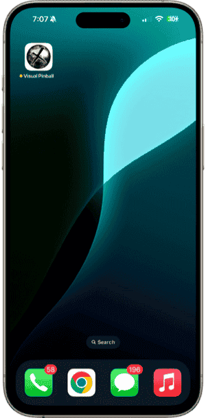
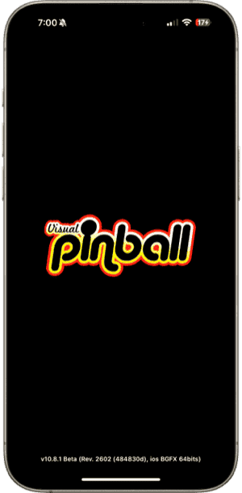
</p>

On the *Table Selection* screen, tap the *+* button in the upper right. Under *Built in...*, select *blankTable.vpx* or *exampleTable.vpx*:

<p align="center">


</p>

After the table is imported, tap it to start:

<p align="center">
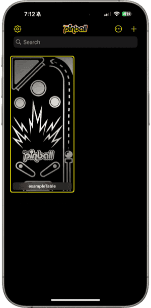
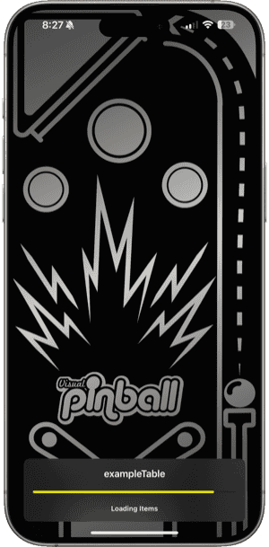
</p>

Play some Visual Pinball!

<p align="center">
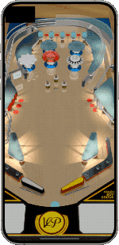
</p>

## Controls

### Touch

On phones and tablets, playing requires touching specific areas of the screen to perform different actions:

<p align="center">
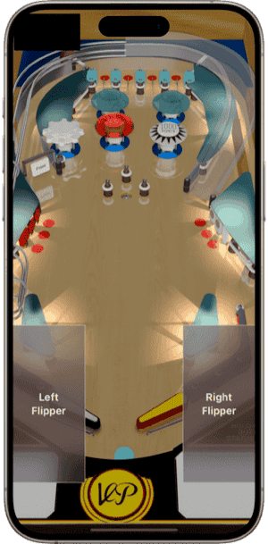
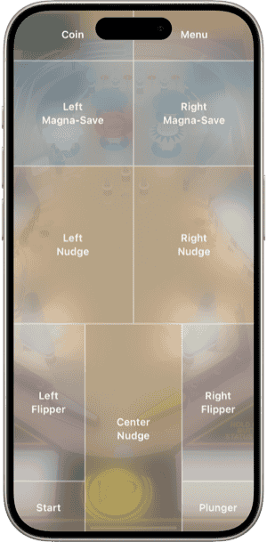
</p>

The touch areas are:

- Coin (top left)
- In-Game UI (top right)
- Left / Right Magna-Save (upper left / upper right)
- Left / Right Nudge (middle left / middle right)
- Left / Right Flipper (lower left / lower right)
- Center Nudge (lower middle)
- Start (bottom left)
- Plunger (bottom right, *long press to pull back*)

The *Touch Overlay* draws these areas on screen. It can be turned on and off from the [In-Game UI](#in-game-ui).

### Keyboard

Bluetooth and USB keyboards are supported. The default keys are:

- *5* - Coin
- *1* - Start
- *Left Shift* / *Right Shift* - Left / Right Flipper
- *Left Control* / *Right Control* - Left / Right Magna Save
- *Z* / */* - Left / Right Nudge
- *Space* - Center Nudge
- *Return* - Plunger (*Hold down to pull back*)
- *T* - Tilt
- *F12* - In-Game UI
- *Escape* - Quit to the *Table Selection* screen
- *End* - Coin Door (*Press once to open, press again to close*)
- *7*, *8*, *9*, *0* - Service Buttons (ROM operator menu)

### Game controller

Bluetooth and USB game controllers are supported. The default layout is:

- *Left / Right Trigger* - Left / Right Flipper (pressing further activates the staged flipper)
- *Left / Right Shoulder* - Left / Right Magna Save
- *Left Stick* - Nudge
- *Right Stick* - Plunger
- *A* (bottom face button) - Launch Ball
- *B* (right face button) - Start
- *Y* (top face button) - Coin
- *Back* - In-Game UI
- *D-pad* - Service Buttons (ROM operator menu), and navigation while the In-Game UI is open

### Meta Quest controllers

The default Touch controller layout is:

- *Left / Right Trigger* - Left / Right Flipper (pressing further activates the staged flipper)
- *Left / Right Grip* - Left / Right Magna Save
- *Left Thumbstick* - Nudge
- *Right Thumbstick* (up / down) - Plunger
- *Right Thumbstick click* - Launch Ball
- *A* - Start
- *B* - Coin
- *X* - In-Game UI
- *Y* - Quit to the *Table Selection* screen
- *Left Thumbstick click* - Align the table to the controllers' position (for setups where the controllers are placed on a physical cabinet)

While the In-Game UI is open, the left thumbstick (up / down) and right thumbstick (left / right) navigate it.

All keyboard, game controller and Quest controller mappings can be changed in *Input Settings* in the [In-Game UI](#in-game-ui).

## In-Game UI

While playing, tap the upper right corner of the screen (or press *Back* on a game controller, *X* on a Quest controller, or *F12* on a keyboard) to open the *In-Game UI*. This is the same menu used by the desktop version of Visual Pinball and is described in [Live User Interface](LiveUI.md). Tap an item to open it, drag to scroll, and use the back button at the top of each page to go back.

From the home page you can open *Table Rules*, *Table Options*, *Point Of View* (*VR Settings* on Quest), *Generic Options*, and all the player settings pages (plugins, sound, graphics, displays, input, plunger, nudge & tilt, cabinet, and more). On mobile, the home page also offers:

- *Enable / Disable Touch Overlay* - Draws the touch areas on screen (phones and tablets)
- *Enable / Disable FPS* - Shows the frames per second counter
- *Quit* - Return to the *Table Selection* screen

Pages that can be saved have buttons at the top to reset to defaults, undo changes, and save. When saving, choose *Save Globally* to use the changes as the default for all tables, or *Save as Table Override* to keep them for the current table only. See [File Layout](FileLayout.md#global-settings-and-table-overrides) for how global settings and table overrides are stored.

## Settings

The app's *Settings* screen, opened with the gear button in the upper left corner of the *Table Selection* screen, only holds the settings that have to be set before a table starts:

- *General* (Android only) - *Graphics Backend* (OpenGL ES or Vulkan), and *Storage* to keep tables in the app's internal storage or in a folder of your choice
- *Performance* - *Max Texture Dimensions*. Reduce this value if tables crash while loading
- *External DMD* - see [External DMDs](#external-dmds)
- *Web Server* - see [Importing Tables](#importing-tables)
- *Miscellaneous* - *Force VR Rendering Mode*, which provides table scripts with `RenderingMode=2` so the backbox and cabinet are rendered (useful for tables that do not provide FSS support)
- *Advanced* - view and export `vpinball.log` and `VPinballX.ini`
- *Support*, *Credits*, *License* and *Reset*

All other settings (graphics, sound, input, plugins, etc.) are changed while playing, using the [In-Game UI](#in-game-ui). The default configuration is usually sufficient for most devices.

Settings are stored in `VPinballX.ini`. See [File Layout](FileLayout.md#visual-pinball-x-installation) for where it is located on each platform.

## Importing Tables

Visual Pinball tables are stored in the `.vpx` file format. Many tables require additional support files, such as scripts, music, graphics, and ROMs. Plain `.vpx` files, `.zip` archives and `.vpxz` files can be imported.

To simplify file transfers, the mobile apps support `.vpxz` files. A `.vpxz` file is simply a `.zip` file renamed, making it easier to bundle all necessary files together. For example, to package a ROM based table, make a folder structure like this:

```
table/
      <table.vpx>
      pinmame/
              roms/
                  <rom.zip>
```

Zip the above folder, and then change the file extension to `.vpxz`:

<p align="center">

</p>

See [File Layout](FileLayout.md#tables-folder-organization) for everything that can be placed next to a table.

To get the file on to your device, there are several options:

- **iOS**: the *Files* app (iCloud Drive or third party apps such as Google Drive and OneDrive), AirDrop, drag and drop on iPad, or the built-in web server. The app's *Documents* folder is also accessible from the *Files* app, and from *Finder* when connected to a Mac.
- **Android**: tap the *+* button and choose *Files* to pick a file, open the file from another app (a file manager, a browser download, a cloud storage app, etc.) and choose *Visual Pinball*, or use the built-in web server.
- **Meta Quest**: the built-in web server is the easiest way. The *+* button can also import files already on the headset.

Using the *Files* app on iOS, simply select the `.vpxz` and confirm the import:

<p align="center">
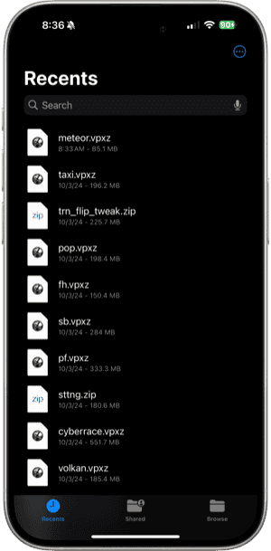
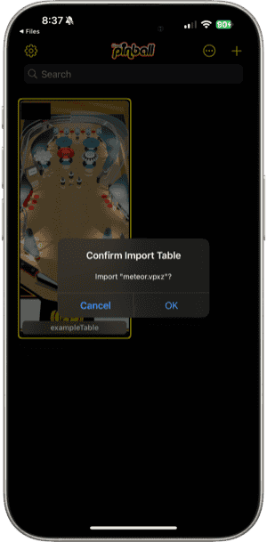
</p>

<p align="center">
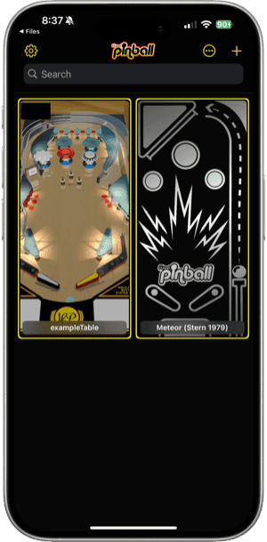
</p>

The **built-in web server** can be enabled in the *Web Server* section of *Settings*. Once running, the address to open in a browser on the same network is shown below the setting. The web page lets you browse, upload, download, rename, move, and delete files, create folders, extract `.zip` and `.vpxz` files, edit text files such as scripts and ini files, view the log, and refresh the table list.

## Table Selection Screen

Change the layout and sort order of the *Table Selection* screen by tapping the *...* button in the upper right, and use the search bar to filter tables by name:

<p align="center">
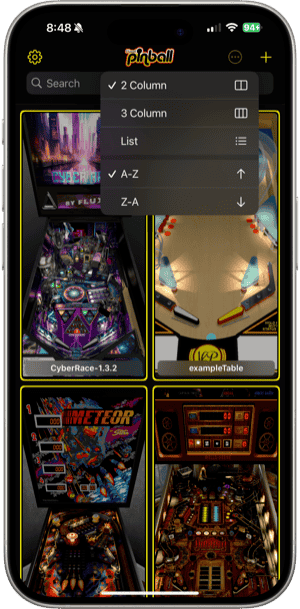
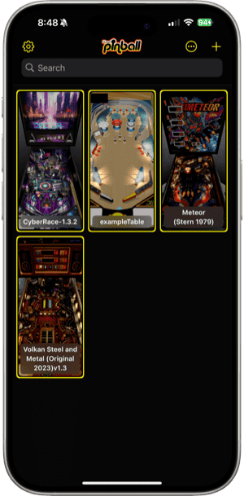
</p>

Long pressing on a table displays a context menu with the following actions:

- Rename
- Table Image
- View Script (or Extract Script if the table does not have a `.vbs` file yet)
- Share - packages the table as a `.vpxz` file
- Reset - removes the table's settings overrides
- Delete

<p align="center">
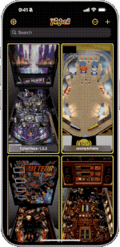
</p>

On iOS, share tables to other devices using AirDrop:

<p align="center">
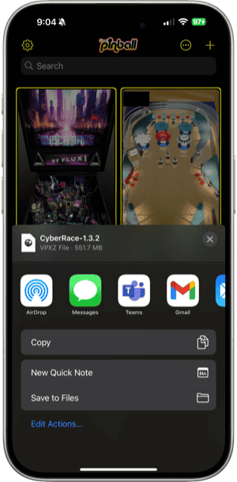
</p>

## External DMDs

The mobile apps support external DMDs (Dot Matrix Displays) using `DMDServer`, which is part of the [libdmdutil](https://github.com/vpinball/libdmdutil) project.

Currently supported DMDs:

- [ZeDMD](https://github.com/PPUC/zedmd)
- [ZeDMD-WiFi](https://github.com/PPUC/zedmd)
- [Pixelcade](https://pixelcade.org/)

The easiest way to run `DMDServer` is to use [ZeDMDOS](https://github.com/PPUC/zedmdos) on a Raspberry Pi.

In the *External DMD* section of *Settings*, select *DMDServer* for *DMD Type* and enter the correct *Address* and *Port* values.

`ZeDMD-WiFi` devices can be connected to directly by selecting *ZeDMD WiFi* for *DMD Type* and entering the device's *Address*. `DMDServer` is not needed.

## Troubleshooting

**Q: When a table starts, a script error occurs immediately.**

**A:** The mobile apps use the VBScript interpreter from [Wine](https://gitlab.winehq.org/wine/wine/-/tree/master/dlls/vbscript), which has some quirks compared to the Windows one. Many newer tables handle these quirks and work without changes. For tables that do have issues, a repository of patched scripts can be found at [vpx-standalone-scripts](https://github.com/jsm174/vpx-standalone-scripts). Name the patched script after the table (`<table>.vbs` for `<table>.vpx`) and place it next to the table file, either by adding it to the `.vpxz` file or by uploading it with the web server.

**Q: Visual Pinball crashes when a table starts.**

**A:** Visual Pinball tables are large and require **a lot** of memory. Reducing the *Max Texture Dimensions* value in the *Performance* section of *Settings* may help.

**Q: My ROM based game loads, but does not seem to do anything.**

**A:** Make sure the table is packaged correctly (see [Importing Tables](#importing-tables)). You can also view the `vpinball.log` in *Settings* to get detailed error information.

**Q: My ROM based game is very quiet, can the volume be changed?**

**A:** Some ROM based games allow the volume to be set via the machine's system menu. To access the system menu, you will need a [keyboard](#keyboard) or [game controller](#game-controller). Press the *End* key to open the "coin door". Use the *8* and *9* keys (or the D-pad) to change the volume. Press the *End* key again to close the "coin door". When exiting the table, the settings will be saved to an NVRAM file.

**Q: My ROM based game seems to have started but I can't do anything?**

**A:** Some ROM based games need to be reset the first time they are powered up. Exiting and restarting the table usually fixes this. You can also press the *7* key on a [keyboard](#keyboard) or *D-pad Left* on a [game controller](#game-controller).

**Q: Do the mobile apps support B2S backglasses, PuP and DMDs?**

**A:** Yes. Backglasses (B2S), PuP and DMDs (PinMAME, FlexDMD) are rendered by plugins, the same as on desktop, and can be configured in *Plugin Settings* in the [In-Game UI](#in-game-ui).

**Q: Can Visual Pinball be customized to do this or that?**

**A:** Visual Pinball is completely free. The [source code](https://github.com/vpinball/vpinball) is open and available for anyone interested in contributing. Contributions are welcome, whether for fixing bugs, adding features, or helping with documentation!

## Support

In *Settings*, go to the *Support* section:

<p align="center">
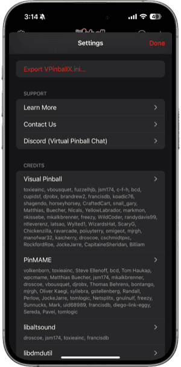
</p>

Tap *Learn More* to open this guide.

Tap *Contact Us* to send an email, or click [here](mailto:jsm174@gmail.com).

Tap *Discord (Virtual Pinball Chat)* to go to the `#vpx-standalone-mobile` channel in the *Virtual Pinball Chat* Discord server, or click [here](https://discord.com/channels/652274650524418078/1323445406524248090).

**Please do not use the GitHub issue queue to request support for the mobile apps!**

## Other Cool Projects

- [vpxtool](https://github.com/francisdb/vpxtool) - Terminal based frontend and utilities for Visual Pinball (@francisdb)

- [PinPal](https://github.com/bartdesign/PinPal) - Portable VPX pinball handheld controller with DMD display (@bartdesign)

<p align="center">
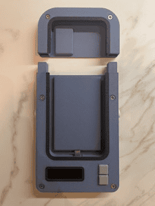
</p>

## Third Party Libraries

Third Party libraries used by Visual Pinball can be found [here](../third-party/README.md).

## License

License information for Visual Pinball can be found [here](../LICENSE).

## Privacy Policy

The Privacy Policy for the mobile apps can be found [here](<Privacy Policy.md>).

## Credits

Visual Pinball for mobile was built upon the work of giants. Without Open Source, none of this would be possible. A huge thanks goes out to all the developers and contributors who have been part of the journey in making Visual Pinball and its ecosystem what it is today!
