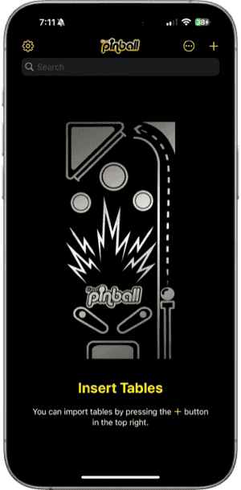
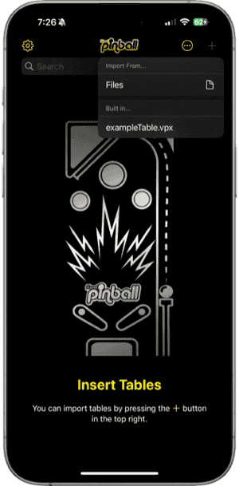
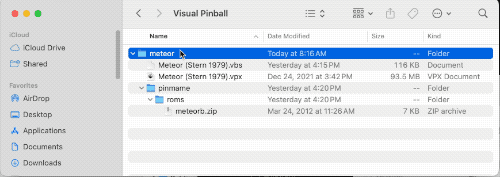

# Visual Pinball on iPhone, iPad, Android and Meta Quest

Visual Pinball is a free, open source pinball simulator. The same player that runs on desktop computers also runs on your phone, tablet or VR headset, so you can play the hundreds of tables the community has built.

## Contents

1. [Before you start](#before-you-start)
2. [Getting the app](#getting-the-app)
3. [Your first game](#your-first-game)
4. [Playing with touch](#playing-with-touch)
5. [Keyboards and game controllers](#keyboards-and-game-controllers)
6. [The in-game menu](#the-in-game-menu)
7. [Adding your own tables](#adding-your-own-tables)
8. [Managing your tables](#managing-your-tables)
9. [Showing the score display and backglass](#showing-the-score-display-and-backglass)
10. [Using a real DMD](#using-a-real-dmd)
11. [App settings](#app-settings)
12. [Meta Quest](#meta-quest)
13. [Troubleshooting](#troubleshooting)
14. [Getting help](#getting-help)
15. [Other cool projects](#other-cool-projects)
16. [Credits, license and privacy](#credits-license-and-privacy)

## Before you start

Visual Pinball is not a download-and-play game. The app is a player; the tables are made by hobbyists and shared on community sites, and many of them need extra files such as a ROM, a backglass or a patched script. Getting a table running takes a little effort, and this guide walks you through it.

The app comes with an example table so you can try it right away.

## Getting the app

**iPhone and iPad:** install *Visual Pinball* from the [App Store](https://apps.apple.com/us/app/visual-pinball/id6547859926). Needs iOS 18 or later.

**Android:** install *Visual Pinball* from Google Play, or install an APK. Needs a 64-bit device running Android 13 or later. Google Play may warn you when installing an APK from another source.

**Meta Quest:** the Quest version is installed by sideloading. See [Meta Quest](#meta-quest) below.

Android and Quest APKs are produced by the project's [GitHub Actions](https://github.com/vpinball/vpinball/actions) builds. If you want to build the apps yourself, see the [build instructions](../make/README.md).

## Your first game

When you open the app for the first time, the table list is empty:

Tap the **+** button in the top right and pick **exampleTable.vpx** under *Built in...*, then tap **OK**:

The table appears in the list. Tap it to play. Tap the bottom left corner to start a game and hold the bottom right corner to pull the plunger:

To leave the table, tap the top right corner to open the menu and choose **Quit**. On Android you can also use the back gesture.

## Playing with touch

The screen is divided into invisible areas. Touching an area presses that button:

| Area | What it does |
|---|---|
| Top left | Insert a coin |
| Top right | Open the [in-game menu](#the-in-game-menu) |
| Upper left / upper right | Left / right magna-save |
| Middle left / middle right | Nudge the table left / right |
| Lower left / lower right | Left / right flipper |
| Lower middle | Nudge the table forward |
| Bottom left | Start a game |
| Bottom right | Plunger. Hold to pull back, let go to launch |

The first few times you start a table, a message reminds you where the areas are. You can also draw the areas on screen while playing: open the in-game menu and choose **Enable Touch Overlay**.

Nudging is done with the touch areas or a game controller. The phone's motion sensors are not used.

On iPhone, Android phones and Quest controllers, flippers, bumpers and slingshots give haptic feedback. The strength of each can be changed in **Input Settings** in the in-game menu.

## Keyboards and game controllers

Bluetooth and USB keyboards and game controllers work on all platforms. These are the defaults; all of them can be changed in **Input Settings** in the in-game menu.

**Keyboard**

| Key | What it does |
|---|---|
| 1 | Start |
| 5 | Insert a coin |
| Left Shift / Right Shift | Left / right flipper |
| Left Control / Right Control | Left / right magna-save |
| Z / / | Nudge left / right |
| Space | Nudge forward |
| Return | Plunger (hold to pull back) |
| T | Tilt |
| F12 | Open the in-game menu |
| Escape | Quit the table |
| End | Open and close the coin door (for ROM games, see [Troubleshooting](#troubleshooting)) |
| 7, 8, 9, 0 | Service buttons (the operator menu of ROM games) |

**Game controller**

| Control | What it does |
|---|---|
| Left / right trigger | Left / right flipper (press further for a staged flipper) |
| Left / right shoulder | Left / right magna-save |
| Left stick | Nudge |
| Right stick | Plunger |
| A (bottom button) | Launch ball |
| B (right button) | Start |
| Y (top button) | Insert a coin |
| Back | Open the in-game menu |
| D-pad | Service buttons, and moving around the in-game menu |

Quest controllers are listed under [Meta Quest](#meta-quest).

## The in-game menu

While playing, tap the top right corner of the screen (or press *Back* on a controller, *X* on a Quest controller, *F12* on a keyboard). This is the same menu as the desktop version of Visual Pinball. Tap an item to open it, drag to scroll, and use the back button at the top of a page to go back.

The top of the menu is about the table you are playing:

- **Table Rules** and **Table Options**, if the table provides them
- **Point Of View** (or **VR Settings** on Quest) to change the camera
- **Generic Options** such as day/night and difficulty

Below that:

- **Enable / Disable Touch Overlay** draws the touch areas on screen
- **Enable / Disable FPS** shows a frame rate counter
- **Quit** returns to the table list. If the table has no picture yet, a screenshot is saved as its picture

Then the settings pages: plugins, sound, graphics, displays, input, plunger, nudge and tilt, and more. The desktop guide to this menu is [Live User Interface](LiveUI.md).

Pages that can be saved have buttons at the top to reset to defaults, undo and save. When saving, **Save Globally** uses the change for every table, while **Save as Table Override** keeps it for this table only. The defaults are fine for most devices and most tables, so you rarely need to change anything here.

## Adding your own tables

### What a table needs

A table is a `.vpx` file. Many tables also need files that sit next to it:

- **ROM games** (most tables based on real machines from the 1980s onward) need the machine's ROM in a `pinmame/roms` folder. The table's description tells you which ROM it needs.
- **A patched script** (`.vbs`) if the table does not run as-is on mobile. See [Troubleshooting](#troubleshooting).
- **Backglass** (`.directb2s`), **music**, **alternate sounds**, **DMD colorizations** and similar extras, each in its own folder.

The full list of folders is in [File Layout](FileLayout.md#tables-folder-organization). The important thing is that everything for one table lives in one folder.

### Packing a table as a .vpxz

To move a table and its files to your device in one go, put them in a folder, zip the folder, and rename the zip file's extension from `.zip` to `.vpxz`:

A plain `.zip` works too, and so does a bare `.vpx` file if the table needs nothing else.

### Getting the file onto your device

**iPhone and iPad**

- Tap the file in the **Files** app (iCloud Drive, Google Drive, OneDrive and so on all work) and confirm the import.
- AirDrop the file from a Mac or another iPhone.
- On iPad, drag and drop the file onto the app.
- Use the web browser method below.

Your tables are also visible in the Files app under *On My iPhone* / *On My iPad* > *Visual Pinball*, and in the Finder sidebar when the device is plugged into a Mac.

**Android**

- Tap **+** then **Files** and pick the file.
- Open the file from your downloads, a file manager or a cloud app and choose *Visual Pinball*.
- Use the web browser method below.

**Meta Quest**

- Use the web browser method below. This is by far the easiest way.

### From a web browser on your computer

The app has a built-in file manager that you open in a browser on the same Wi-Fi network:

1. Open **Settings** (gear icon) in the app and turn on **Enabled** under *Web Server*.
2. The address to use appears below the switch, for example `http://192.168.1.20:2112`. Type it into a browser on your computer.
3. Upload your `.vpx`, `.vpxz` or `.zip` files. Archives can be unpacked in place with **Extract**.
4. Click **Refresh Tables** so the new tables show up in the app.

The page also lets you download, rename, move and delete files, create folders, edit scripts and settings files, and watch the log while a table runs. Turn the web server off again when you are done.

## Managing your tables

The **...** button in the top right switches between a grid and a list, changes the size of the grid, and sorts by name. The search box filters the list by name.

Press and hold a table to get its menu:

- **Rename** changes the name shown in the list. The files are not renamed.
- **Table Image** lets you pick a picture from your photo library, or reset it. When you quit a table that has no picture yet, a screenshot is used automatically.
- **View Script** opens the table's script. If the table has no separate script file yet, this reads **Extract Script** and creates one next to the table. This is how you get a script to edit when a table needs patching.
- **Share** packs the table and all its files into a `.vpxz` file and opens the share sheet, so you can send it to another device.
- **Reset** removes the settings you saved for this table only. It is greyed out if there are none.
- **Delete** removes the table and its files.

Reset and Delete act immediately. There is no confirmation.

## Showing the score display and backglass

Real pinball machines have a score display above the playfield, and a backglass above that. On a phone there is only one screen, so by default the app shows the playfield alone and the score display is hidden. You can show it as a small window on top of the playfield:

1. While playing, open the [in-game menu](#the-in-game-menu).
2. Choose **Display Settings**, then **ScoreView Display**.
3. Turn on **Enable**. The score display appears over the playfield.
4. Drag it to where you want it, or set **Width**, **Height**, **X Position** and **Y Position** on the same page.
5. Save with **Save Globally** so it shows on every table.

This works for the dot matrix displays of ROM games as well as the older alphanumeric and reel displays, and for FlexDMD tables. The display is drawn with a glass-like look by the ScoreView plugin; a table can ship its own layout as a `.scv` file.

A backglass is shown the same way, with **Backglass Display** instead of ScoreView Display, as long as the table has a `.directb2s` file next to it.

Colorized DMDs work automatically if the colorization files are in the table's `serum`, `vni` or `pinmame/altcolor` folder.

## Using a real DMD

If you own a [ZeDMD](https://github.com/PPUC/zedmd), ZeDMD-WiFi or [Pixelcade](https://pixelcade.org/) display, the app can send the score display to it over your network.

- **ZeDMD-WiFi** connects directly. In the app's **Settings**, under *External DMD*, set **DMD Type** to *ZeDMD WiFi* and enter the device's address. The default `zedmd-wifi.local` usually works.
- **ZeDMD** (USB) and **Pixelcade** need a small computer running `DMDServer`, which is part of [libdmdutil](https://github.com/vpinball/libdmdutil). The easiest way is [ZeDMDOS](https://github.com/PPUC/zedmdos) on a Raspberry Pi. Set **DMD Type** to *DMDServer* and enter the Pi's address and port (6789 by default).

## App settings

The gear icon on the table list opens the app's settings. These are the few things that have to be set before a table starts; everything else is in the [in-game menu](#the-in-game-menu).

- **Graphics Backend** (Android only): OpenGL ES or Vulkan. Try the other one if tables look wrong or run slowly.
- **Storage** (Android only): *Internal* keeps tables inside the app. *Custom* lets you pick any folder, for example on an SD card. With a custom folder, the table's files are copied into the app before it starts and any changes copied back afterwards, so starting a table takes a moment longer.
- **Max Texture Dimensions**: large tables use a lot of memory. If a table crashes while loading, lower this value. The default is 3072.
- **External DMD**: see [Using a real DMD](#using-a-real-dmd).
- **Web Server**: see [From a web browser on your computer](#from-a-web-browser-on-your-computer).
- **Force VR Rendering Mode**: some tables only show their backbox and cabinet when they think they are in VR. Turn this on if a table looks like it is missing them.
- **Advanced**: view, share or clear the log file, and view the settings file. Useful when asking for help.
- **Reset** puts every setting back to its default.

## Meta Quest

The Quest version is the Android app built for the headset. Tables are played in VR, standing in front of a virtual machine.

**Installing:** the app is not on the Meta store, so it is sideloaded. Turn on developer mode for your headset in the Meta Horizon phone app, plug the headset into your computer, allow USB debugging in the headset, then install the `quest` APK with `adb install <file>.apk` or a sideloading tool such as SideQuest.

**Adding tables:** the app opens as a flat panel with the same table list as on a phone. Use the [web browser method](#from-a-web-browser-on-your-computer) to copy tables over.

**Controllers:**

| Control | What it does |
|---|---|
| Left / right trigger | Left / right flipper (press further for a staged flipper) |
| Left / right grip | Left / right magna-save |
| Left thumbstick | Nudge |
| Right thumbstick up / down | Plunger |
| Right thumbstick click | Launch ball |
| A | Start |
| B | Insert a coin |
| X | Open the in-game menu |
| Y | Quit the table |
| Left thumbstick click | Line the table up with where your controllers are, for playing on a real cabinet |

In the in-game menu, move with the left thumbstick and change values with the right thumbstick.

**VR Settings:** in the in-game menu, *VR Settings* replaces *Point Of View*. There you can move and turn the table, set the size of the virtual cabinet, choose the headset refresh rate, and turn on **Color Keyed Passthrough** to see your room behind the table. Passthrough is applied when a table starts, so save the setting and restart the table.

**Settings:** the same as Android, except that *Graphics Backend* and *Force VR Rendering Mode* are not shown.

## Troubleshooting

**The table shows a script error as soon as it starts.**
The mobile apps run table scripts with a different engine than Windows, and a few older tables use features it does not support. The community keeps fixed scripts at [vpx-standalone-scripts](https://github.com/jsm174/vpx-standalone-scripts). Download the `.vbs` for your table, give it the same name as the `.vpx` file, and put it next to the table, either inside the `.vpxz` before importing or by uploading it with the web browser method.

**The app crashes while a table is loading.**
The table needs more memory than the device has. Lower **Max Texture Dimensions** in the app's settings.

**A ROM game loads but nothing happens, or the display stays blank.**
Check that the ROM `.zip` is in a `pinmame/roms` folder next to the table and has the name the table expects. The log file (*Advanced* in the app's settings, or *Log Stream* in the web browser page) shows what went wrong.

**A ROM game starts but will not take coins or start.**
Some machines need a reset the first time they are switched on. Quit the table and start it again. If that does not help, press *7* on a keyboard or *D-pad left* on a controller.

**A ROM game is very quiet.**
The volume of many machines is set in the machine's own menu. With a keyboard, press *End* to open the coin door, use *8* and *9* to change the volume, and press *End* again to close the door. The setting is remembered.

**I cannot see the score or the dot matrix display.**
It is hidden by default. See [Showing the score display and backglass](#showing-the-score-display-and-backglass).

**The table looks like it is missing its backbox or cabinet.**
Turn on **Force VR Rendering Mode** in the app's settings.

**Can the app do this or that?**
Visual Pinball is free and open source. The [source code](https://github.com/vpinball/vpinball) is public and contributions are welcome, whether it is fixing bugs, adding features or improving this guide.

## Getting help

The *Support* section of the app's settings has a **Learn More** button that opens this guide, a **Contact Us** button that writes an email, and a link to the `#vpx-standalone-mobile` channel on the [Virtual Pinball Chat](https://discord.com/channels/652274650524418078/1323445406524248090) Discord server. Discord is the best place to ask questions.

When asking for help, include the log file from *Advanced* in the app's settings.

Please do not use the GitHub issue tracker to ask for help with the mobile apps.

## Other cool projects

- [vpxtool](https://github.com/francisdb/vpxtool) is a command line tool for working with table files (@francisdb).
- [PinPal](https://github.com/bartdesign/PinPal) is a 3D-printed handheld case with real flipper buttons and a small DMD that your phone slides into (@bartdesign):

## Credits, license and privacy

Visual Pinball for mobile is built on the work of many open source projects. The *Credits* section of the app's settings lists them and their contributors, and the full list of third party libraries is [here](../third-party/README.md). The license is [here](../LICENSE) and the privacy policy for the mobile apps is [here](../PRIVACY.md).
