# Visual Pinball on iPhone, iPad, Android and Meta Quest

Visual Pinball is a free, open source pinball simulator. The same player that runs on desktop computers also runs on your phone, tablet or VR headset, so you can play the hundreds of tables the community has built.

## Contents

1. [Before you start](#before-you-start)
2. [Getting the app](#getting-the-app)
3. [Your first game](#your-first-game)
4. [Playing with touch](#playing-with-touch)
5. [Keyboards and game controllers](#keyboards-and-game-controllers)
6. [The in-game menu](#the-in-game-menu)
7. [Showing the score view](#showing-the-score-view)
8. [App settings](#app-settings)
9. [Adding your own tables](#adding-your-own-tables)
10. [Managing your tables](#managing-your-tables)
11. [Using a real DMD](#using-a-real-dmd)
12. [Meta Quest](#meta-quest)
13. [Troubleshooting](#troubleshooting)
14. [Getting help](#getting-help)
15. [Credits, license and privacy](#credits-license-and-privacy)

## Before you start

Visual Pinball started as a Windows program in 2000 and has been open source since 2010. It is made by volunteers, and the mobile apps run the very same engine as the desktop version. The app is free, has no ads or in-app purchases, and its [source code](https://github.com/vpinball/vpinball) is public.

It is not a download-and-play game. The app is a player; the tables come from the community. Hobbyists build them and share them on sites such as [VPUniverse](https://vpuniverse.com) and [VPForums](https://www.vpforums.org), and many tables need a few extra files to work:

- Tables based on real machines usually need that machine's **ROM**. ROMs are not included with the app or with the tables, and the project cannot tell you where to find them.
- Some tables need a **patched script** to run on mobile, and many come with a **backglass**, music or other extras.

Getting a table running takes work, and this guide walks you through it. If you get stuck, ask in the `#vpx-standalone-mobile` channel on the [Virtual Pinball Chat](https://discord.com/channels/652274650524418078/1323445406524248090) Discord server; see [Getting help](#getting-help).

The app comes with an example table so you can try it right away.

## Getting the app

**iPhone and iPad:** install *Visual Pinball* from the [App Store](https://apps.apple.com/us/app/visual-pinball/id6547859926). Needs iOS 26 or later.

**Android:** install *Visual Pinball* from Google Play, or install an APK. Needs a 64-bit device running Android 13 or later. Google Play may warn you when installing an APK from another source.

**Meta Quest:** the Quest version is installed by sideloading. See [Meta Quest](#meta-quest) below.

Android and Quest APKs are produced by the project's [GitHub Actions](https://github.com/vpinball/vpinball/actions) builds. If you want to build the apps yourself, see the [build instructions](../make/README.md).

## Your first game

When you open the app for the first time, the table list is empty. Tap the **+** button in the bottom right and pick **exampleTable.vpx** under *Built in...*, then tap **OK**:

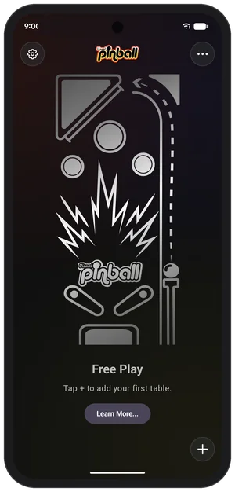&nbsp;&nbsp;
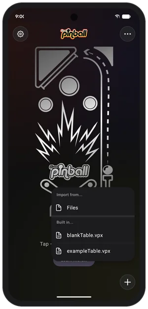

The table appears in the list. Tap it to play. Tap the bottom left corner to start a game and hold the bottom right corner to pull the plunger:

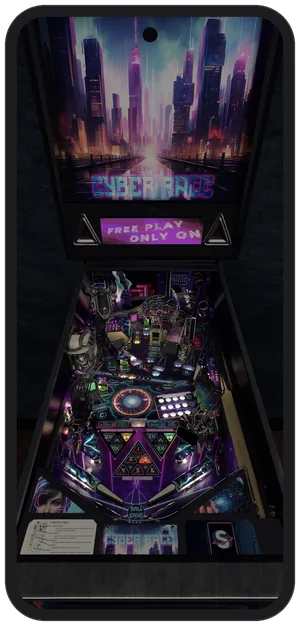

To leave the table, tap the top right corner to open the menu and choose **Quit**. On Android you can also use the back gesture.

## Playing with touch

The screen is divided into invisible areas. Touching an area presses that button:

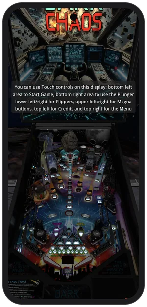

| Area | What it does |
|---|---|
| Top left | Insert a coin |
| Top right | Open the [in-game menu](#the-in-game-menu) |
| Upper left / upper right | Left / right magna-save |
| Middle left / middle right | Nudge the table left / right |
| Lower left / lower right | Left / right flipper |
| Lower middle | Nudge the table forward |
| Bottom left | Start a game |
| Bottom right | Plunger. Hold to pull back, let go to launch |

The first few times you start a table, a message reminds you where the areas are. You can also draw them on screen while playing: open the in-game menu and choose **Enable Touch Overlay**.

Nudging is done with the touch areas or a game controller; the phone's motion sensors are not used. Flippers, bumpers and slingshots give haptic feedback on iPhone, Android phones and Quest controllers. The strength can be changed in **Input Settings** in the in-game menu.

## Keyboards and game controllers

Bluetooth and USB keyboards and game controllers work on all platforms, and you can change every button in **Input Settings** in the in-game menu. Out of the box:

- **Keyboard:** the usual Visual Pinball keys. *1* starts a game, *5* inserts a coin, the *Shift* keys are the flippers, *Return* is the plunger, *F12* opens the in-game menu and *Escape* quits the table.
- **Game controller:** the triggers are the flippers, the right stick is the plunger, *B* starts a game, *Y* inserts a coin, the left stick nudges and *Back* opens the in-game menu.

## The in-game menu

While playing, tap the top right corner of the screen (or press *Back* on a controller, *X* on a Quest controller, *F12* on a keyboard). This is the same menu as the desktop version of Visual Pinball. Tap an item to open it, drag to scroll, and use the arrow at the top of a page to go back.

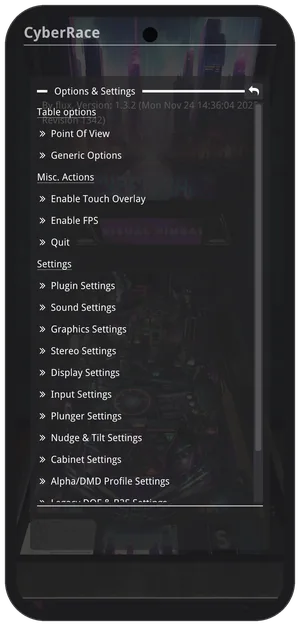

Most of the menu is settings for sound, graphics, displays, controls and more. The defaults work well on most phones and with most tables, so you rarely need to change anything. When you do, save with the button at the top of the page: **Save Globally** keeps the change for every table, **Save as Table Override** for this table only.

## Showing the score view

Real pinball machines have a score display above the playfield, and a backglass above that. On a phone there is only one screen, so by default the app shows the playfield alone and the score display is hidden. You can show it as a small window on top of the playfield. Here is how, using Cyber Race as an example:

1. While playing, tap the top right corner to open the in-game menu and choose **Display Settings**, then **ScoreView Display**.
2. Turn on **Enable**. The score display appears, covering the whole screen at first.
3. Set **Width**, **Height**, **X Position** and **Y Position** so it sits where you want it, or simply drag the window into place.
4. Tap the save button at the top of the page and choose **Save Globally** so it shows up on every table.

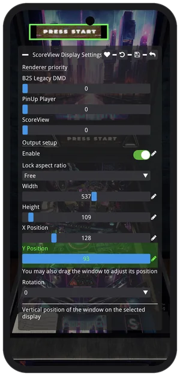&nbsp;&nbsp;
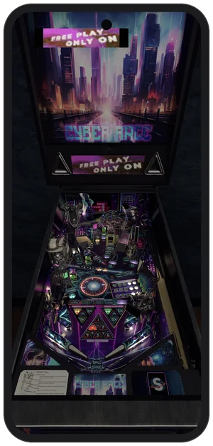

This works for the dot matrix displays of ROM games, the older alphanumeric and reel displays, and tables with a display of their own. A backglass is shown the same way, with **Backglass Display** instead of ScoreView Display, as long as the table has a `.directb2s` file next to it.

## App settings

The gear icon on the table list opens the app's settings. These are the few things that have to be set before a table starts; everything else is in the [in-game menu](#the-in-game-menu).

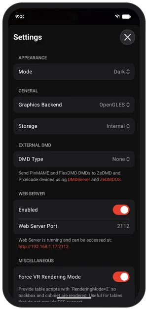&nbsp;&nbsp;
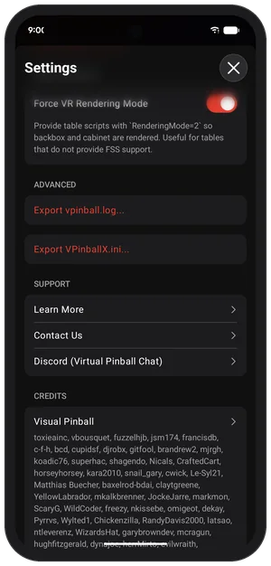

- **Appearance**: *Dark*, *Light* or *System*. The app starts in dark mode.
- **Graphics Backend** (Android only): OpenGL ES or Vulkan. Try the other one if tables look wrong or run slowly.
- **Storage** (Android only): *Internal* keeps tables inside the app. *Custom* lets you pick any folder, for example on an SD card. With a custom folder, the table's files are copied into the app before it starts and any changes copied back afterwards, so starting a table takes a moment longer.
- **External DMD**: see [Using a real DMD](#using-a-real-dmd).
- **Web Server**: see [From a web browser on your computer](#from-a-web-browser-on-your-computer).
- **Force VR Rendering Mode**: some tables only draw their backbox and cabinet when they think they are running in VR. Turn this on if a table is missing them.
- **Advanced**: view, share or clear the log file, and view the settings file. Useful when asking for help.
- **Support**: opens this guide, writes an email, or takes you to the Discord server.
- **Credits** lists the people and projects that make Visual Pinball possible.
- **Reset** puts every setting back to its default.

## Adding your own tables

### What a table needs

A table is a `.vpx` file. Many tables also need files that sit next to it:

- **ROM games** (most tables based on real machines from the 1980s onward) need the machine's ROM in a `pinmame/roms` folder. The table's description tells you which ROM it needs.
- **A patched script** (`.vbs`) if the table does not run as-is on mobile. The community keeps fixed scripts at [vpx-standalone-scripts](https://github.com/jsm174/vpx-standalone-scripts); give the `.vbs` the same name as the `.vpx` file and put it next to it.
- **B2S backglass** (`.directb2s`), **PUP packs**, **FlexDMD**, **music**, **AltSound packs**, **DMD colorizations** (Serum and VNI) and similar extras, each in its own folder.

The full list of folders is in [File Layout](FileLayout.md#tables-folder-organization). The important thing is that everything for one table lives in one folder.

### Packing a table as a .vpxz

To move a table and its files to your device in one go, put them in a folder, zip the folder, and rename the zip file's extension from `.zip` to `.vpxz`:

A plain `.zip` works too, and so does a bare `.vpx` file if the table needs nothing else.

### Getting the file onto your device

**iPhone and iPad**

- Tap the file in the **Files** app (iCloud Drive, Google Drive, OneDrive and so on all work) and confirm the import.
- AirDrop the file from a Mac or another iPhone.
- On iPad, drag and drop the file onto the app.
- Use the web browser method below.

Your tables are also visible in the Files app under *On My iPhone* / *On My iPad* > *Visual Pinball*, and in the Finder sidebar when the device is plugged into a Mac.

**Android**

- Tap **+** then **Files** and pick the file.
- Open the file from your downloads, a file manager or a cloud app and choose *Visual Pinball*.
- Use the web browser method below.

**Meta Quest**

- Use the web browser method below. This is by far the easiest way.

### From a web browser on your computer

The app has a built-in file manager that you open in a browser on the same Wi-Fi network:

1. Open **Settings** (gear icon) in the app and turn on **Enabled** under *Web Server*. The address to use appears below the switch, for example `http://192.168.1.17:2112`.
2. Type that address into a browser on your computer.
3. Create a folder for the table, open it, and upload your `.vpx`, `.vpxz` or `.zip` file into it. Archives can be unpacked in place with **Extract**.
4. Click **Refresh Tables** so the new table shows up in the app.

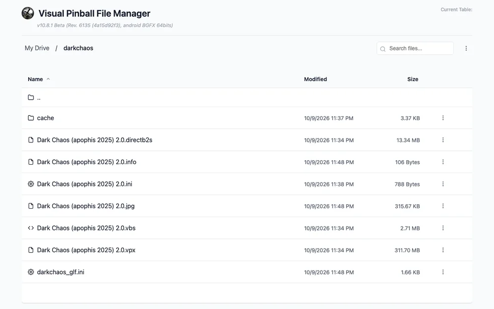

The page also lets you download, rename, move and delete files, create folders, edit scripts and settings files, and watch the log while a table runs. Turn the web server off again when you are done.

## Managing your tables

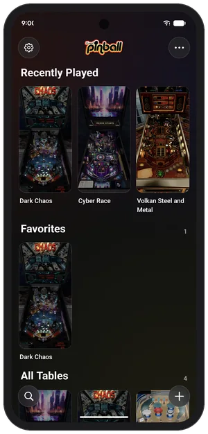&nbsp;&nbsp;
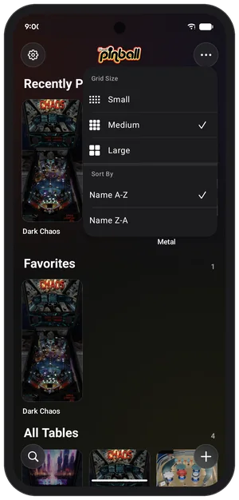

Tables you have played recently and tables you have marked as favorites get their own rows at the top of the list. The **...** button changes the size of the grid and the sort order, and the search button finds a table by name.

Press and hold a table for its menu. From there you can add it to your favorites, rename it, give it a picture, share it as a `.vpxz` file, reset its settings or delete it.

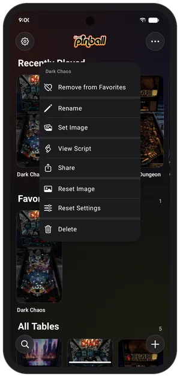

## Using a real DMD

If you own a [ZeDMD](https://github.com/PPUC/zedmd), ZeDMD-WiFi or [Pixelcade](https://pixelcade.org/) display, the app can send the score display to it over your network.

- **ZeDMD-WiFi** connects directly. In the app's **Settings**, under *External DMD*, set **DMD Type** to *ZeDMD WiFi* and enter the device's address. The default `zedmd-wifi.local` usually works.
- **ZeDMD** (USB) and **Pixelcade** need a small computer running `DMDServer`, which is part of [libdmdutil](https://github.com/vpinball/libdmdutil). The easiest way is [ZeDMDOS](https://github.com/PPUC/zedmdos) on a Raspberry Pi. Set **DMD Type** to *DMDServer* and enter the Pi's address and port (6789 by default).

## Meta Quest

The Quest version is the Android app built for the headset. Tables are played in VR, standing in front of a virtual machine.

**Installing:** the app is not on the Meta store, so it is sideloaded. Turn on developer mode for your headset in the Meta Horizon phone app, plug the headset into your computer, allow USB debugging in the headset, then install the `quest` APK with `adb install <file>.apk` or a sideloading tool such as SideQuest.

**Adding tables:** the app opens as a flat panel with the same table list as on a phone. Use the [web browser method](#from-a-web-browser-on-your-computer) to copy tables over.

## Troubleshooting

**You can hear the coin drop, but nothing happens and the display stays blank.**
The table is most likely missing its ROM. Check that the ROM `.zip` is in a `pinmame/roms` folder next to the table and has the name the table expects.

**The table starts but will not take coins or start a game.**
ROM based games sometimes need a reset the first time they are switched on. Quit the table and start it again. If that does not help, press *7* on a keyboard or *D-pad left* on a controller.

**The table is quiet.**
ROM based games set their volume in the machine's own menu. Using a Bluetooth or wired keyboard, press *End* to open the coin door, use *8* and *9* to change the volume, and press *End* again to close the door. The setting is remembered.

**I cannot see the score or the dot matrix display.**
It is hidden by default. See [Showing the score view](#showing-the-score-view).

**The table looks like it is missing its backbox or cabinet.**
Turn on **Force VR Rendering Mode** in the app's settings.

## Getting help

The *Support* section of the app's settings has a **Learn More** button that opens this guide, a **Contact Us** button that writes an email, and a link to the `#vpx-standalone-mobile` channel on the [Virtual Pinball Chat](https://discord.com/channels/652274650524418078/1323445406524248090) Discord server. Discord is the best place to ask questions.

When asking for help, include the log file from *Advanced* in the app's settings.

Please do not use the GitHub issue tracker to ask for help with the mobile apps.

Found a bug, or missing a feature? Visual Pinball is open source and contributions are welcome, whether that is fixing bugs, adding features or improving this guide. The [source code](https://github.com/vpinball/vpinball) is on GitHub.

## Credits, license and privacy

Visual Pinball is the work of many people over many years, and the mobile apps stand on dozens of other open source projects. The *Credits* section of the app's settings names them all; the full list of third party libraries is in [third-party/README.md](../third-party/README.md).

Visual Pinball is released under the [GPL license](../LICENSE). The mobile apps collect no personal data; the [privacy policy](../PRIVACY.md) has the details.
