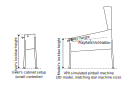

# Upgrading a table to 10.8.1

## Table of Contents
1. [VR/XR Setup](#vr/xr-setup)
2. [Ball motion trail/blur](ball-motion-trail/blur)

VPX 10.8.1 tries to be entirely backwards compatible and should not require any update to existing tables. Information below describes new features and how to support them.

## VR/XR Setup

To support Virtual Reality and Mixed Reality play, tables must includes environment elements like a room and a cabinet beside the usual playfield elements.

Each user setup is different leading to different positionning of things in the real world. For example, a player may use a cabinet where the lockbar 
is placed at 80cm from the ground while the simulated table has a cabinet with a lockbar placed at 85cm from ground. It is also unlikely that the player's
cabinet lockbar width will perfectly match the one of the emulated pinball cabinet.

VPX handles these differences by performing a few scaling and positionning which are applied depending of the category of each part. 
This is done by placing parts in different layers, and selecting in the layer properties a space reference:
- The **playfield** space corresponds to the playfield parts. It is placed at the playfield level, inclined according to the default table inclination, and scaled to match user settings.
  The playfield level is defined as the user defined lockbar height (defined in the real world) minus the distance between the glass and the playfield (bottom glass height).
  The scale is defined by the relative difference between the user defined lockbar width and the emulated table lockbar width, computed from the playfield width.
- The **room** space corresponds to the room parts. These parts are rendered as is, using headset roomscale acquisition, without any transformation.
- The **cabinet** space corresponds to the cabinet parts, excluding the feet and playfield. It is aligned and scaled with the playfield, but not inclined.
  Playfield alignement is done using the lockbar height value that the table author defines in the table property. This value corresponds to the
  distance between the ground and the top of the lockbar of the cabinet model.
- The **cabinet feet** space corresponds to the cabinet feet. It mostly matches the cabinet positionning but with 3D model ground aligned to real world ground, and applying a vertical strech to align to the playfield level as defined in the cabinet space.
  This allows the feet of the cabinet to always match the room ground (not dropping below or floating above) while the upper part of the feet match the cabinet position.

To sum it up:
- the cabinet, playfield and feets are ***scaled*** according to the user defined ***lockbar width*** against the table's lockbar width, computed from the playfield width,
- the cabinet, playfield and feets are ***positionned*** so that the cabinet 3D model's ***lockbar height*** matches the real world user defined lockbar height,
- the feet are stretched in order to satisfy the 2 previous point, while still always touching ground,
- the playfield is inclined by the default inclination defined by the table author,
- the room is kept untransformed and displayed at real world scale.

An example is provided in the default table which contains the setup and elements for a standard WPC sized cabinet.

## Ball motion trail/blur

VPX used to only provided a fake/hacked ball motion trails. These are now deprecated in favor of a cleaner motion blur. There is nothing to do on the table authoring side as these parameters have moved to the general application settings.

[Information applicable to version 10.8.1]
