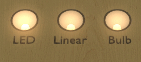

# Upgrading a table to 10.8.X

VPX 10.8.X tries to be entirely backwards compatible. Therefore, existing tables should look exactly the same as with 10.7, except for the 3 following points:
- parts below the playfield used to be always invisible unless they were tagged as 'Active', now they can be visible (e.g. through kicker holes),
- reflections used to be rendered differently, so they will likely look somewhat different than before,
- scripts were not allowed to adjust static parts at all, now this is possible during table initialization, therefore tables that would tweak a static part (intentionally or by accident) and rely on the fact that the changes are not processed will need to be updated.

Beside these eventually needed updates, 10.8.X offers new features that can be leveraged by updating the table. The main ones are described below.


## Table of Contents
1. [Ball Shadows](#ball-shadows)
2. [Ball Reflections](#ball-reflections)
3. [Playfield transparency](#playfield-transparency)
4. [Playfield Cutouts and Lower Playfield](#playfield-cutouts-and-lower-playfield)
5. [Reflections](#reflections)
6. [Better light fading](better-light-fading)
7. [Simplified scripting](#simplified-scripting)
8. [Better static parts](#better-static-parts)
9. [Additional DMD](additional-dmd)
10. [Primitive Depth Masking](primitive-depth-masking)


## Ball Shadows
Dynamically raytraced ball shadows were added to lights. To enable them, just enable the corresponding checkbox in the light properties.


Left: no shadow / Right: with ball shadow


## Ball Reflections
Balls used to be rendered using a 'sphere map' that have the drawback of being view independent, therefore not interacting with the viewer if the camera moves (for example in VR or with headtracking). They can now use an 'equirectangular map', so the same type of texture layout as used already for the environment lighting.


Left: sphere mapping / Right: view dependent equirectangular mapping


## Playfield Transparency
Before 10.8.0, the playfield did only support binary transparency, that is to say either opaque or fully transparent based on the alpha threshold value defined on the playfield image. Now, alpha blended transparency is fully supported, allowing better rendering of tranparent parts like inserts.

There is nothing special to do to be able to use it. Using the feature, the alpha mask property of images should always be set to 1. It is mainly kept for backwards compatibility.


If you are using a custom 'playfield_mesh'-named primitive for the playfield visuals, all the properties are now processed like any other primitive. Especially the 'Disable Lighting From Below' parameter is now supported.


## Playfield Cutouts and lower playfield
Before 10.8.0, parts under the playfield needed to be created separately, using an 'Active' material. This restriction does not apply any more. Therefore, you can just create a playfield primitive with its nice beveled cutouts, name it 'playfield_mesh' in order to get good looking cutouts.

The same applies to lower playfields. These used to need an active material and could not be marked as static. This does not apply anymore.


## Reflections
Reflections used to be limited to the playfield, with no VR nor camera mode support, not taking into account the actual playfield geometry (parts above a hole or outside of the playfield would reflect just like if there was a playfield beneath them).

Now, reflections are implemented using 'reflection probes', using 2 'rendering passes': the first one evaluates the reflected incoming light, the second one actually draws the object using this precomputed incoming light.
This offers the following benefits:
- VR support (and also camera mode & LiveUI),
- process the playfield like any [other parts](playfield-transparency),
- use reflections on any part,
- reflections are rendered with the object they are applied to, therefore taking into account its geometry: e.g. no more reflections in the playfield hole,
- in addition, a new 'roughness' parameter was added to allow for blurry reflections.

If the table uses the default playfield (i.e. it does not feature a custom 'playfield_mesh'-named primitive), VPX will handle the reflection probe automatically based on user and table settings.
For backwards compatibility, loading a pre-10.8.0 table with a 'playfield_mesh' primitive, VPX will create a default playfield renderprobe and apply it to this primitive.

To define a reflection probe, in the new 'Reflection Probe manager, one can set up the reflection plane by specifying its normal and the position along this normal.


The default table offers an example with its 3 reflection probes: one for the playfield, and one for each of the cabinet sides.


## Better light fading

Light fading was updated and now offers 3 modes:
- None: no fading,
- Linear: linear interpolation, like in previous versions of VPX,
- Incandescent: fading according to a physical model of a bulb, computing the evolution of the temperature of the filament over time.


If one is using a custom fader (implemented in your script), then the 'None' fading mode is your friend. Otherwise, the 'Incandescent' mode should give more realistic results than the 'linear' mode.




## Simplified Scripting
A new event called `Animate` was added to most animated parts. It allows to simplify the script written to sync custom visual parts (e.g. primitives) with their actually animated counterparts.

For example, the following code implemented in VPX 10.7
```
Sub Table1_KeyDown(ByVal keycode)
	If keycode = LeftFlipperKey Then
		LeftFlipper.TimerEnabled = True 'This line is only for ninuzzu's flipper shadows!
		LeftFlipper.RotateToEnd
	End If
End Sub

Sub LeftFlipper_Init()
	LeftFlipper.TimerInterval = 10
End Sub

Sub LeftFlipper_Timer()
	FlipperLSh.RotZ = LeftFlipper.CurrentAngle
	If LeftFlipper.CurrentAngle = LeftFlipper.StartAngle Then
		LeftFlipper.TimerEnabled = False
	End If
End Sub
```

can be replaced by:
```
Sub Table1_KeyDown(ByVal keycode)
	If keycode = LeftFlipperKey Then
		LeftFlipper.RotateToEnd
	End If
End Sub

Sub LeftFlipper_Animate()
	FlipperLSh.RotZ = LeftFlipper.CurrentAngle
End Sub
```

Custom fading of lights and flashers can also be largely simplified by using the new [light fading](#better-light-fading), leveraging the new 'lightmap' property of flashers and/or using the 'Animate' event, thus reducing the performance impact of the script (which can lead to e.g. microstutter on some systems otherwise).


## Better Static Parts
VPX 10.8.X allows the script to update the properties of 'static' parts during initialization and preprocessing, so within the main script part and in all the 'Init' events of the table and its parts. This can for example be leveraged to adjust the visibility of static parts depending on the display setup (e.g. VR vs cab vs desktop vs FSS) or user-selected options.

For example:
```
' Detect if VPX is rendering in VR and adjust visibility of parts within the VR_Cab collection
Dim VRThings
If RenderingMode = 2 Then
	For Each VRThings In VR_Cab
		VRThings.visible = 1
	Next
Else
	For Each VRThings In VR_Cab
		VRThings.visible = 0
	Next
End If
```


## Additional DMD

VPX 10.8.0 added the ability to setup a custom DMD for any flasher object.
This allows to have multiple DMDs, for example to add an ingame option menu, or to handle additional real DMDs (e.g. Monopoly or TSPP tables).


## Primitive Depth Masking

Primitives have a new property that allows to disable 'depth masking', which otherwise is used during rendering to hide all parts behind the primitive.


Depth Masking should be disabled for transparent primitive if:
- these are used to render fake/approximate shadows,
- these have visible self overlapping parts (plastic ramps, in conjunction with the option to render backfacing faces).


Left image shows an (exaggerated) ambient occlusion artefact due to depth masking. Right image shows the same, but with depth masking disabled.


Left image shows the ramp from VPW's Last Action Hero in 10.7, while the right image shows it with the mask option disabled.

<sub><sup>[Information applicable to version 10.8.X]</sup></sub>
