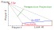
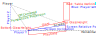

# View Setup

VPX offers 2 ways of rendering to the screen:
- using a [perspective camera](#Perspective-camera), this is the default and usual way to render the table when used on a desktop computer,
- using a [window projection](#Window-projection), which is designed to be used inside a pinball cabinet (cab), optionally with headtracking.

## Perspective camera
The perspective camera is the usual way of defining a view in most video games. VPX uses this when the 'View Layout Mode' is set to 'Legacy' or 'Camera'.

'Legacy' is the old way of defining the camera, kept for backwards compatibility. The following information applies to 'Camera' mode only.

The 'camera' view is setup by the following properties:
- Player X/Y/Z is the view position from the bottom center of the playfield,
- Look At is the point the player is looking at, defined as a percentage of the playfield height (0% is at the lockbar, 100% at the back),
- Field of View is the overall scale,
- Horizontal/Vertical Offset adjusts the position of rendered parts in the projection,
- Horizontal/Vertical Stretch scales the rendered view (after perspective projection).

The perspective projection (green) is displayed on the screen (blue).

## Window projection
When VPX is used to emulate a pinball table on a TV screen inside a cabinet, the player is located on the side of the screen instead of being in front.
The rendering is also expected to be somewhat different since it is supposed to mislead the viewer into believing there is actually a real playfield 'inside' the screen, eventually using headtracking and/or 3D stereo rendering to increase this perception.

The window projection mode is a new (as of VPX 10.8) mode which tries to simulate this bevhavior.

The window projection (green) is displayed on the screen (blue). The projection is parallel to the screen.

The 'window' mode needs to know about the physical setup of the screen. Since this setting does not change between tables, it is located in the video settings:
- Screen width and height are the physical size of the display area (in centimeters). The width is always the longest edge of the screen,
- Screen inclination is the angle between horizontal and the screen,
- Player X, Y, Z are the player coordinates as shown on the figure.

Once this information is defined, the view can be adjusted per table with the following properties:
- Table X and YZ scales allow to stretch the table to the screen. When set to 100%, the table size matches the real world table size. Scaling on the Y and Z axis is fixed to be always the same.
- Horizontal/Vertical offset adjusts the position of rendered parts in the projection,
- Window Top/Bottom Z offsets define the position of the screen relative to the playfield/glass of the table.

The existing implementation does not perform (yet) perspective distortion compensation. Sadly, this may lead to some distortion at the back of the screen.

[Information applicable to version 10.8.1 Beta]
