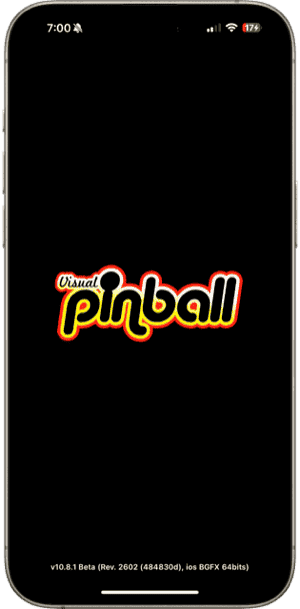

# Visual Pinball for iOS

Experience the open source pinball simulator now on your iPhone!

[](https://apps.apple.com/us/app/visual-pinball/id6547859926?itscg=30200&itsct=apps_box_badge&mttnsubad=6547859926)

## Table of contents

1. [Features](#features)
2. [Before you begin](#before-you-begin)
3. [Quick start](#quick-start)
4. [Controls](#controls)
5. [Live UI](#live-ui)
6. [Settings](#settings)
7. [Importing Tables](#importing-tables)
8. [Miscellaneous Features](#miscellaneous-features)
9. [External DMDs](#external-dmds)
10. [Troubleshooting](#troubleshooting)
11. [Support](#support)
12. [Other Cool Projects](#other-cool-projects)
13. [Third Party Libraries](#third-party-libraries)
14. [License](#license)
15. [Privacy Policy](#privacy-policy)
16. [Credits](#credits)

## Features

- Play hundreds of community and hobbyist-developed tables.
- Feel the action with haptic feedback for bumpers, targets, and flippers.
- Customize your experience with a simple, intuitive interface for settings, table options, and pov adjustments.
- Keyboard and game controller support.
- External DMD support for [ZeDMD](https://github.com/PPUC/zedmd), [ZeDMD-WiFi](https://github.com/PPUC/zedmd), and [Pixelcade](https://pixelcade.org/) devices.
- [Serum](https://github.com/zesinger/libserum) AltColor support.
- [AltSound](https://github.com/vpinball/libaltsound) support.
- Touch overlay shows touch areas.
- Step-by-step touch instructions when playing a table.
- Advanced options for power users, including script and log file exports.
- Support for iOS 18 Game Mode.

## Before you begin

We’ve worked to make setting up tables as **simple** as possible for iOS, and while it’s much easier than on Desktop platforms, it still **requires some effort**! Visual Pinball isn’t always a download-and-play experience -- it gives you flexibility and control, but that comes with a bit of **complexity**.

If this sounds like something you can handle, read on!

## Quick start

After downloading from the App Store, launch the app:

<p align="center">


</p>

On the *Table Selection* screen, tap the *+* button in the upper right and select the *exampleTable.vpx* option:

<p align="center">


</p>

After the example table is imported, tap it to start:

<p align="center">


</p>

Follow the *Touch Instructions* and play some Visual Pinball!

<p align="center">

</p>

## Controls

Playing *Visual Pinball for iOS* requires touching specific areas of the screen to perform different actions:

<p align="center">


</p>

The touch areas are:

- Coin 
- Menu 
- Left / Right Magna-Save 
- Left / Center / Right Nudge
- Left / Right Flipper
- Start
- Plunger (*Long press to pull back*)

*Visual Pinball for iOS* supports bluetooth and USB keyboards. The keys are:

- *5* - Coin
- *Escape* - Menu
- *Left Command* - Left Magna Save
- *Right Command* - Right Magna Save
- *Z* - Left Nudge
- */* - Right Nudge
- *Space* - Center Nudge
- *Left Shift* - Left Flipper
- *Right Shift* - Right Flipper
- *1* - Start
- *Return* - Plunger (*Hold down to pull back*)
- *End* - Coin Door (*Press once to open, press again to close*)

*Visual Pinball for iOS* supports game controllers. The game controller layout is:

- *Left Shoulder* - Left Flipper
- *Right Shoulder* - Right Flipper
- *Left Stick* - Left Magna Save
- *Right Stick* - Right Magna Save
- *D-pad Up* - Center Tilt
- *D-pad Left* - Left Tilt
- *D-pad Right* - Right Tilt
- *D-pad Down* - Plunger
- *A* - Add Credit
- *B* - Start
- *X* - FPS
- *Y* - Cancel
- *Guide* - Fire

## Live UI

While playing a game, tap the upper right corner of the screen to bring up the *Live UI*:

<p align="center">

</p>

The following actions are available:

- *Resume* - Resume playing
- *Overlay* - Toggles the *Touch Overlay* on/off
- *FPS* - Toggles the *Frames Per Second HUD* on/off
- *Artwork* - Capture the current screen and save as table artwork
- *Quit* - Return to the *Table Selection* screen

In addition to the above actions, *Table Options* and *Point of View* can be adjusted:

<p align="center">


</p>

Save or reset *Table Options* and *Point of View* by using the *Save* and *Reset* buttons.

## Settings

Settings are accessible by tapping on the *Settings* button in the upper left corner of the *Table Selection* screen:

<p align="center">

</p>

Settings are grouped into the following sections:

- General
- External DMD
- Display
- Environment Lighting
- Ball Rendering
- Performance
- Anti-Aliasing
- Miscellaneous
- Web Server
- Advanced
- Support
- Credits / License
- Reset

To stay in parity with the desktop version of Visual Pinball, numerous settings are available. The default configuration is usually sufficient for most devices.

## Importing Tables

Visual Pinball tables are stored in the `.vpx` file format. Many tables require additional support files, such as scripts, music, graphics, and ROMs.

To simplify file transfers, *Visual Pinball for iOS* supports `.vpxz` files. A `.vpxz` file is simply a `.zip` file renamed, making it easier to bundle all necessary files together.

For example, to package a ROM based table, simply make a folder structure like this: 

```
table/
      <table.vpx>
      pinmame/
              roms/
                  <rom.zip>
```

Zip the above folder, and then change the file extension to `.vpxz`:

<p align="center">

</p>

To get the file `.vpxz` file on to your device, there are several options:

- Files App (iCloud Drive)
- Third Party App (Google Drive, One Drive, etc.)
- AirDrop
- Drag and Drop (iOS 18.1)

Using the *Files* app, simply select the `.vpxz` and confirm the import:

<p align="center">


</p>

<p align="center">

</p>

## Miscellaneous Features

You can change the layout and sort order of the *Table Selection* screen by tapping the *...* button in the upper right:

<p align="center">


</p>

Long pressing on a table will display a context menu with the following actions:

- Rename
- Change Artwork
- View Script
- Share
- Reset
- Delete

<p align="center">

</p>

Share tables to other devices using AirDrop:

<p align="center">

</p>

## External DMDs

*Visual Pinball for iOS* supports external DMDs (Dot Matrix Displays) using `DMDServer` which is part of the [libdmdutil](https://github.com/vpinball/libdmdutil) project.

Currently supported DMDs:

- [ZeDMD](https://github.com/PPUC/zedmd)
- [ZeDMD-WiFi](https://github.com/PPUC/zedmd)
- [Pixelcade](https://pixelcade.org/)

The easiest way to run `DMDServer` is to use [ZeDMDOS](https://github.com/ppuc/zedmdos) on a Raspberry Pi. 

In settings, select *DMDServer* for *DMD Type* and enter the correct *Address* and *Port* values.

<p align="center">

</p>

`ZeDMD-WiFi` devices can be directly connected to and do not need `DMDServer`:

<p align="center">

</p>

## Troubleshooting

**Q: When a table starts, a script error occurs immediately.**

**A:** *Visual Pinball for iOS* is based on *Visual Pinball Standalone*, which uses the VBScript interpreter from [Wine](https://gitlab.winehq.org/wine/wine/-/tree/master/dlls/vbscript) and has some quirks described [here](../vbscript.md). Many newer tables handle these quirks and work without changes. For tables that do have issues, a repository of scripts can be found [here](https://github.com/jsm174/vpx-standalone-scripts). Simply add the corresponding `<table>.vbs` to the `.vpxz` file, and the table should run.

**Q: Visual Pinball crashes when a table starts.**

**A:** Visual Pinball tables are large and require **a lot** of memory. If a *Low Memory Warning* is displayed (the loading progress bar turns red), reducing the *Max Texture Dimensions* value in *Settings* may help. *Visual Pinball for iOS* can detect this and provides a direct link to the *Max Texture Dimensions* settings:

<p align="center">


</p>

**Q: My ROM based game loads, but does not seem to do anything.**

**A:** Make sure the table is packaged correctly (see [Importing Tables](#importing-tables)). You can also view the `vpinball.log` in *Settings* to get detailed error information.

**Q: My ROM based game is very quiet, can the volume be changed?**

**A:** Some ROM based games allow the volume to be set via the machine's system menu. To access the system menu, you will need a [bluetooth or usb keyboard](#controls). Press the *END* key to open the "coin door". Use the *8* and *9* keys to change the volume. Press the *END* key again to close the "coin door". When exitting the table, the settings will be saved to an NVRAM file.

**Q: My ROM based game is seems to have started but I can't do anything?**

**A:** Some ROM based games need to be reset the first time they are powered up. Exitting and restarting the table usually will fix this. You can also use a [bluetooth or usb keyboard](#controls) and press the *7* key.

**Q: *Visual Pinball for iOS* appears like an iPhone app on an iPad.**

**A:** Currently, *Visual Pinball for iOS* is only targeted for iPhones. An iPad version is planned for the future.

**Q: Does *Visual Pinball* for iOS support B2S and PuP?**

**A:** *Visual Pinball for iOS* is capable of rendering the B2S and PuP windows. However, due to SDL's current limitations on iOS, only one window can be rendered at a time. A solution for this is being explored.

**Q: Is it possible to get a cabinet view with a DMD overlaid in the corner of the screen?**

**A:** *Visual Pinball for iOS* can render the DMD window (PinMAME or FlexDMD). However, due to SDL's current limitations on iOS, only one window can be rendered at a time. A solution for this is being explored.

**Q: Can *Visual Pinball for iOS* be customized to do this or that?**

**A:** *Visual Pinball for iOS* is completely free and has been in development for over two years. The [source code](https://github.com/vpinball/vpinball) is open and available for anyone interested in contributing. Contributions are welcome, whether for fixing bugs, adding features, or helping with documentation!

## Support

In *Settings*, go to the *Support* section:

<p align="center">

</p>

Tap *Contact Us* to send an email, or click [here](mailto:jsm174@gmail.com).

Tap *Discord (Virtual Pinball Chat)* to go to the `#standalone` channel in the *Virtual Pinball Chat* Discord server, or click [here](https://discord.com/channels/652274650524418078/1076655472846831667).

**Please do not use the GitHub issue queue to request support for *Visual Pinball for iOS*!**

## Other Cool Projects

- [vpxtool](https://github.com/francisdb/vpxtool) - Terminal based frontend and utilities for Visual Pinball (@francisdb)

- [PinPal](https://github.com/bartdesign/PinPal) - Portable VPX pinball handheld controller with DMD display (@bartdesign)

<p align="center">

</p>

## Third Party Libraries

Third Party libraries for *Visual Pinball for iOS* can be found [here](../../../third-party/README.md).

## License

License information for *Visual Pinball for iOS* can be found [here](../../../LICENSE).

## Privacy Policy

The Privacy Policy for *Visual Pinball for iOS* can be found [here](PrivacyPolicy.md).

## Credits

 *Visual Pinball for iOS* was built upon the work of giants. Without Open Source, none of this would be possible. A huge thanks goes out to all the developers and contributors who have been part of the journey in making Visual Pinball and its ecosystem what it is today!